# Maataa Workstation user guide

<!-- Generated by scripts/build-help.js from docs/help/*.md. Edit those files, then run `npm run help:build`. -->

Maataa Workstation is a local AI workspace: chat with local models, search your documents, make images, video and audio, run skills, tools, agents and workflows, and change code in folders you approve. Everything runs on your computer. The same guide is inside Maataa under **Help & Support**, and as pages in `docs/site/`.

## Contents

- [Welcome to Maataa](#welcome-to-maataa)
- [Install and start Maataa](#install-and-start-maataa)
- [First steps](#first-steps)
- [A tour of the interface](#a-tour-of-the-interface)
- [The setup checklist](#the-setup-checklist)
- [The helper](#the-helper)
- [Chat and sessions](#chat-and-sessions)
- [Models](#models)
- [Knowledge and Retrieval Lab](#knowledge-and-retrieval-lab)
- [Automations and Evaluations](#automations-and-evaluations)
- [Add sources, live steps, computer and voice](#add-sources-live-steps-computer-and-voice)
- [Images](#images)
- [Video](#video)
- [Audio, songs and transcripts](#audio-songs-and-transcripts)
- [Boards, Timeline and Library](#boards-timeline-and-library)
- [Voice Studio](#voice-studio)
- [Skills](#skills)
- [Tools and approvals (MCP Registry)](#tools-and-approvals-mcp-registry)
- [Agents](#agents)
- [Workflows](#workflows)
- [Neuron Factory](#neuron-factory)
- [Collector, Capability Graph and Provider Browser](#collector-capability-graph-and-provider-browser)
- [Workbench](#workbench)
- [Policies, budgets and rollback](#policies-budgets-and-rollback)
- [Agent Browser](#agent-browser)
- [Built, not yet in the console](#built-not-yet-in-the-console)
- [Local Workspace and projects](#local-workspace-and-projects)
- [Diagnostics, Runtime, Trace and History](#diagnostics-runtime-trace-and-history)
- [Settings, privacy and your data](#settings-privacy-and-your-data)
- [The desktop app and portable pack](#the-desktop-app-and-portable-pack)
- [Get help and support](#get-help-and-support)
- [Troubleshooting](#troubleshooting)
- [Frequently asked questions](#frequently-asked-questions)

## Welcome to Maataa

*What Maataa is, how the screen is organised, and what stays on your computer.*

Maataa Workstation is a workspace for local AI. You chat with models that run on your computer, search your own documents, make images, video and audio, run skills and tools, build agents and workflows, and change code in folders you approve. Maataa's server listens only on `127.0.0.1:8787`, so nothing on your network can reach it.

> **Note** Maataa Workstation used to be called NOVA. It is the same app with the same data: your sessions, models, knowledge, characters and evidence are where they were. NOVA is still its engineering name, so you will see it in file names such as **Build NOVA app.command**. The helper keeps the name Nova.

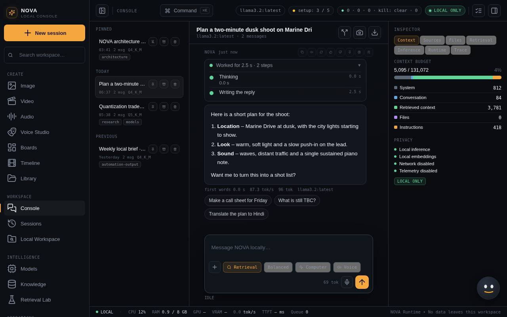
### How Maataa is organised

The sidebar groups every screen by what you do there:

| Group | Screens | What they are for |
| --- | --- | --- |
| Create | Image, Video, Audio, Voice Studio, Boards, Timeline, Library | Making media on this computer, arranging it and cutting it together |
| Workspace | Console, Sessions, Local Workspace | Chatting with models, and changing code in approved folders |
| Intelligence | Models, Knowledge, Retrieval Lab | The models you have, your documents, and testing search over them |
| Operations | Automations, Evaluations, Workbench, Agent Browser | Scheduled runs, model comparisons, oversight of background work, and the browser agents use |
| Capabilities | Skills, MCP Registry, Agents, Workflows, Neuron Factory, Collector, Capability Graph, Provider Browser | What models may do, and the guard rails around it |
| System | Runtime, Trace, Git Updates, Execution History, Diagnostics, Settings, Help & Support | Seeing what happened and keeping Maataa healthy |

Read [A tour of the interface](#a-tour-of-the-interface) for the top bar, the command palette and the status bar. The face in the bottom right corner is [the helper](#the-helper): ask it how to do anything, or let it walk you through a task.

### Oversight

[Workbench](#workbench) shows what Maataa is running in the background, what waits for your decision and what broke, and has the **kill switch** that stops it all. The **setup** pill in the top bar counts [five steps](#the-setup-checklist) from a fresh install to work Maataa has checked.

### What stays on your computer

- Your conversations, documents, media, settings and history are stored in a local database and in ordinary files on this computer.
- Models run through Ollama on this computer. Image, video and audio models run in ComfyUI or local tools on this computer.
- Maataa uses the network only when you turn on **Settings > Privacy > Allow network access**, for example to install packages or let the browser tool open a web page. The pill in the top bar says **LOCAL ONLY** while that is off.
- Tools that can change things (files, git, the browser) ask for your approval, and agents and workflows follow the same rules.
- Background work follows [policies and budgets](#policies-budgets-and-rollback), and **halt** in Workbench stops it at once.

> **Tip** Some records in a new install are examples that show how a screen works (a few sessions, agents and workflows). A model synced from Ollama, an indexed document, a connected tool server and a finished run in Execution History are the signs that something is really working.

### Where to go next

1. [Install and start Maataa](#install-and-start-maataa)
2. [First steps](#first-steps): check everything works, sync your models and send a first message
3. [The setup checklist](#the-setup-checklist)
4. [Chat and sessions](#chat-and-sessions)

## Install and start Maataa

*The desktop app, the portable folder and browser mode, what each needs, and where Maataa keeps your data.*

There are three ways to run Maataa. They all run the same server and the same console.

| Way | Best for | How to start |
| --- | --- | --- |
| Desktop app | Everyday use | Open **Maataa Workstation.app** |
| Portable folder | Running without installing, or on another Mac | Double-click **Start Maataa.command** in the folder |
| Browser mode | Developing Maataa itself | `npm start` in `nova-console`, then open `http://127.0.0.1:8787/` |

### What you need

- **A Mac with Apple silicon** for the packed app and portable folder. Both carry their own Node runtime, so you do not need to install Node for them. Browser mode needs Node 22.5 or newer.
- **Ollama** for chat, embeddings, evaluations and automations. Install it from ollama.com, then pull at least one model, for example `ollama pull llama3.2`. Maataa opens without Ollama, but anything that needs a model reports that Ollama is unavailable.
- **Optional engines** for media: ComfyUI for images, songs and sound effects (install it from **Settings > Image engine**; Maataa starts and stops it for you); LTX-2 for AI video; whisper.cpp for transcripts; Kokoro for better voices. Each has a double-click installer in the brahmini folder. See [Images](#images), [Video](#video) and [Audio, songs and transcripts](#audio-songs-and-transcripts).

### The desktop app

1. Open **Maataa Workstation.app**. Maataa starts its local server first, then shows the Console.
2. The first time, macOS may block it because the app is not notarized. Open **System Settings > Privacy & Security** and choose **Open Anyway**, or right-click the app and choose **Open**.
3. Closing Maataa also stops its server. A Maataa icon in the menu bar can show, hide or refresh the window.

To make a fresh copy of the app, the dmg and the portable folder from the source, see [The desktop app and packing](#the-desktop-app-and-portable-pack).

### Browser mode

From the `nova-console` folder:

```
npm start
```

Then open `http://127.0.0.1:8787/`. Use that address rather than opening `public/index.html` directly. Optional settings:

| Variable | Default | Use |
| --- | --- | --- |
| `PORT` | `8787` | Another local port for Maataa |
| `OLLAMA_HOST` | `http://127.0.0.1:11434` | Ollama on another local address |
| `DATA_DIR` | `./data` | Where browser mode keeps its database |
| `NOVA_LIBRARY_DIR` | `~/Documents/NOVA Library` | Where Maataa saves what it makes |

### Where Maataa keeps your data

| Running as | Database and log |
| --- | --- |
| Desktop app or portable folder | `~/Library/Application Support/com.brahmini.nova-runtime/` |
| Browser mode | `nova-console/data/` (or `DATA_DIR`) |

The folder holds `nova.db` (the database) and, for the app, `nova-runtime-server.log`. Everything Maataa makes is also saved as ordinary files in `~/Documents/NOVA Library`. Do not edit or delete `nova.db` while Maataa is running. The app and browser mode keep separate data, so sessions from one do not appear in the other.

> **Important** Back up the data folder only while Maataa is closed, and keep backups private: they contain your conversations, documents and history.

## First steps

*A ten-minute checklist: confirm Maataa is healthy, sync your models, chat, index a document and test search.*

Do these steps once after installing, before you schedule automations or give an agent tools.

### 1. Check that Maataa is healthy

Open **Diagnostics** (System group). Each row says whether a part is working and what to do if it is not. The first row, **Maataa Workstation backend**, must be healthy. Rows for Ollama, ComfyUI or transcription can wait until you need them.

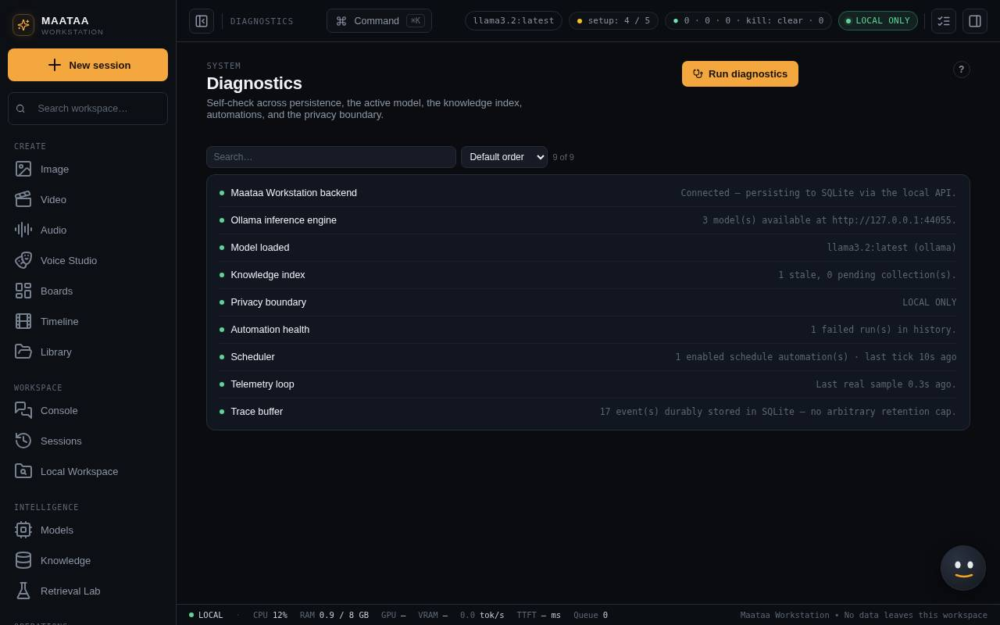
### 2. Sync your models

1. Make sure Ollama is running and has at least one model (`ollama list` in Terminal shows them).
2. Open **Models** and press **Sync from Ollama**. Your models appear as cards.
3. Choose one in the model pill at the top right of the Console.

For coding tasks and Build with Maataa, a model of 7B parameters or more gives much better results than a 1–3B model.

### 3. Send a first message

Press **New session**, type a question in the box at the bottom of the Console and press Enter. The answer streams in, with timing under it. See [Chat and sessions](#chat-and-sessions).

[Video: Starting a session and sending a first message.](../public/help/media/chat.mp4)
### 4. Add a document and test search

1. Open **Knowledge**, create a collection (for example "Product notes") and add a text, Markdown, HTML or PDF file.
2. Wait until the document shows its chunk count. Maataa uses your Ollama embedding model to index it.
3. Open **Retrieval Lab**, pick the collection and ask a question the document answers. The best-matching passages appear with their scores.

When retrieval is on in the Console (the **Retrieval** chip under the message box), answers cite those passages.

### 5. Look around

- Press ⌘K for the command palette, which jumps to any screen.
- The **?** next to each screen title explains what you can do there, with a link to its full guide.
- **Help & Support** in the System group has every guide, the FAQ, troubleshooting and a support report.

## A tour of the interface

*The sidebar, top bar, command palette, inspector, status bar, per-screen help, list tools, and using Maataa in a narrow window or on a phone.*

### The sidebar

The sidebar on the left lists every screen, grouped by purpose. The button at the top left of the top bar folds it to icons. **New session** starts a conversation, and the search box filters your sessions list.

### The top bar

- **Command** (⌘K) opens the command palette: type part of a screen or action ("agents", "diagnostics", "new session") and press Enter.
- The **model pill** shows the model new messages use. Click it to change model.
- The **privacy pill** reads **LOCAL ONLY** while network access is off and the model runs locally, and changes when that is no longer true.
- The **setup** pill (for example **setup: 3 / 5**) shows how many of the [five setup steps](#the-setup-checklist) are done. Click it to see what is left.
- The **Workbench strip** (for example **0 · 0 · 0 · kill: clear · 0**) counts queued jobs, running jobs, items waiting for you, the kill switch and finished jobs. Hover for the words, click to open [Workbench](#workbench).
- The last button opens or closes the **inspector** on the right of the Console.

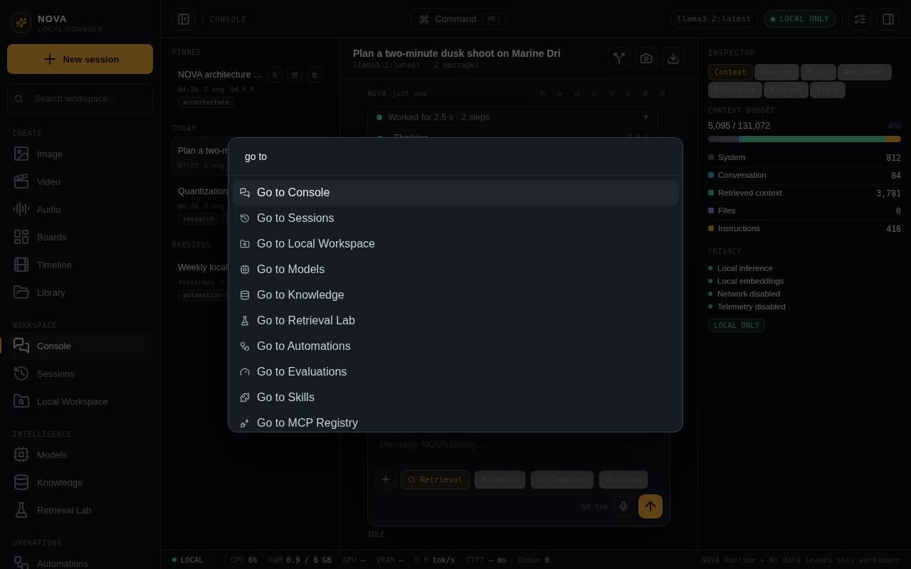
### The inspector

In the Console, the inspector shows what went into the last answer: **Context** (how the prompt budget was spent), **Sources** (retrieved passages), **Files**, **Retrieval**, **Inference** settings, **Runtime** and **Trace**. In narrower windows it slides over the conversation; close it with ×.

### The status bar

The strip at the bottom shows whether Maataa is local, CPU and memory use, GPU and VRAM where macOS reports them, the last generation speed (tokens per second), time to first token and how many jobs are queued.

### Help on every screen

- The **helper** in the bottom right corner answers questions about the screen you are on, by text or voice, and walks you through tasks step by step. See [The helper](#the-helper).

- The **?** next to a screen's title opens a short explanation on the right, with **Read the full guide** to open the matching article in Help & Support.
- Some panels have their own **?** (Media's video, audio, filter and library panels).
- **Help & Support** in the System group has every guide, the FAQ, troubleshooting and the support report.

### Search, filter and sort

Every longer list (skills, sessions, models, documents, media, history, agents, tool servers) has a search box, a tag filter built from its badges (installed, running, failed…) and a sort. Maataa remembers your choices for each list.

### Narrow windows and phones

Maataa adapts to the window:

- Below about 1,180 pixels wide the Console's inspector becomes a drawer.
- Below about 820 pixels wide (a small window, or a phone opening `http://<your-mac>:8787` through a tunnel you set up yourself) the sidebar becomes a menu: press ☰ at the top left to open it, and it closes when you pick a screen. The sessions list opens from the button at the top right.

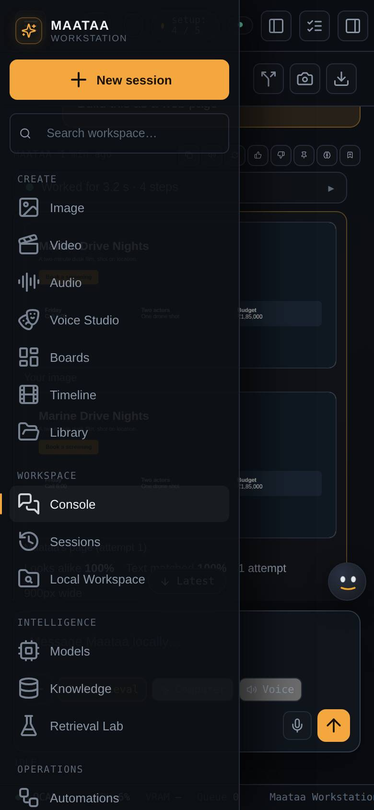
> **Important** Maataa listens only on this computer. Do not expose port 8787 to other devices without adding your own authentication; Maataa has no login by design.

## The setup checklist

*The "setup" pill in the top bar counts five steps from a fresh install to work Maataa has checked. Click it to see what is left and where to do it.*

The **setup** pill in the top bar (for example **setup: 3 / 5**) shows how far this computer has come. Click it to open **Get started**, which lists the five steps. Each step that is not done yet has a button that takes you to the screen where you do it.

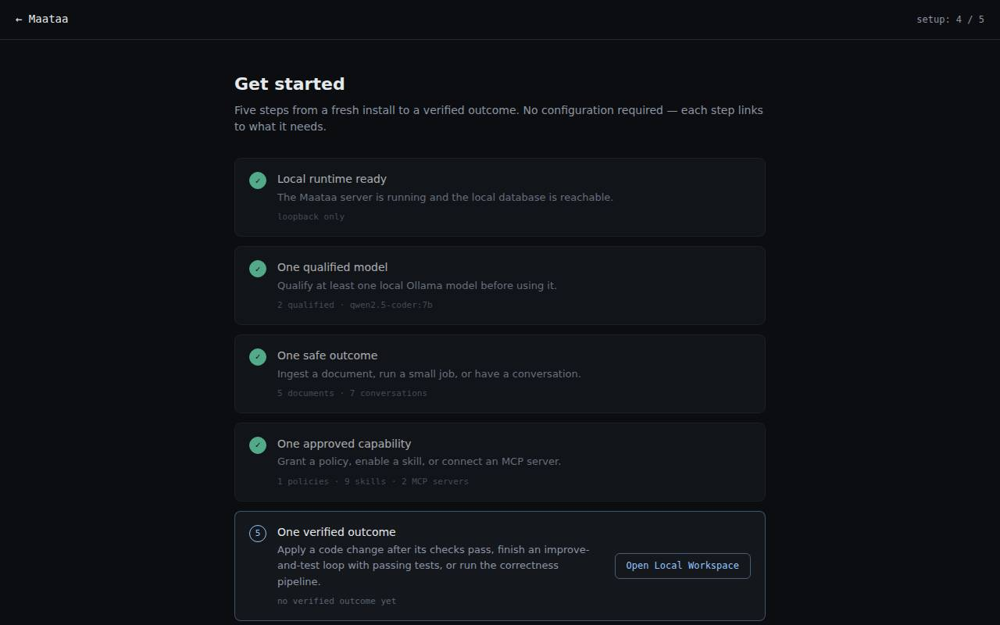
### The five steps

| Step | Done when | Where to do it |
| --- | --- | --- |
| 1. Local runtime ready | Maataa's server is running and its database opens. This is always done once you can see the page. | — |
| 2. One qualified model | At least one Ollama model has passed Maataa's coding checks | **Models** → **Qualify for coding** ([Models](#models)) |
| 3. One safe outcome | You have had a conversation, indexed a document or finished a background job | **Console**, or **Knowledge** |
| 4. One approved capability | A skill is enabled, a tool server is connected, or a policy grant exists | **Skills**, or **MCP Registry** |
| 5. One verified outcome | A code change was applied after its checks passed, or an improve-and-test loop ended with passing tests | **Local Workspace** ([Local Workspace](#local-workspace-and-projects)) |

When all five are done, the page says **Setup complete** and links to the Console and Workbench.

### Things to know

- The checklist only reads what is already in Maataa. It never changes anything, and you can ignore it: every screen works whether or not the steps are done.
- Step 2 matters if you want Maataa to plan code. Code plans and the improve-and-test loop only use models that passed the coding checks.
- A step counts things that really happened on this computer. The example records some screens start with do not count.

## The helper

*The face in the bottom right corner. Ask it how to do anything, hold its mic to talk, or let it walk you through a task step by step on screen.*

The face in the bottom right corner is Maataa's helper. Think of it as a colleague sitting next to you who knows Maataa well: ask it how to do something and it answers in a sentence or two, out loud if you like, and can show you the way.

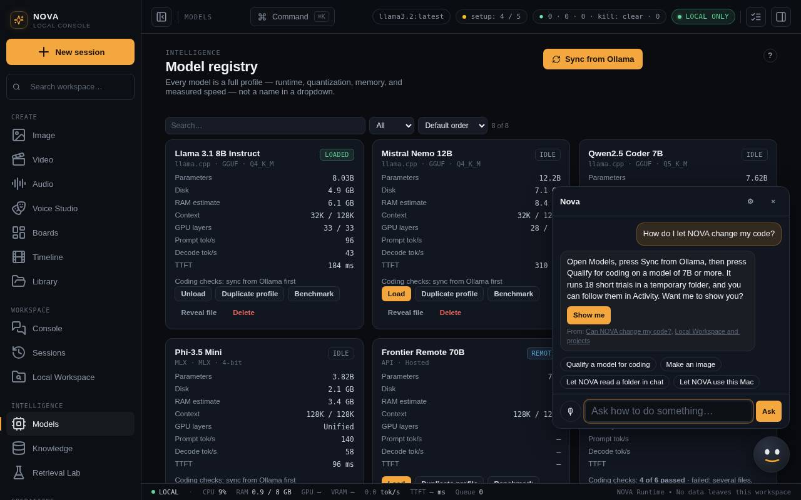
### Ask

- Click the face, type a question and press **Ask**, for example "how do I let Maataa change my code?".
- Or **hold the 🎙 button**, speak, and let go. Your voice is turned into text on this Mac (it needs whisper.cpp, like the microphone in chat). Talking while the helper is speaking cuts it off, as you would with a person.
- The helper knows which screen you are on, and answers from Maataa's own help guides. Under each answer, **From:** links to the guides it used.
- The face shows what it is doing: a red pulse while it listens, a turning ring while it thinks, and its mouth moves while it talks.

### Show me

When it helps, an answer ends with a button:

- **Show me** starts a walkthrough. Maataa opens the right screen, dims everything else and points at one control at a time with a short note (read aloud if you like). **Next**, **Back** and **Stop**, or press Esc.
- **Open …** goes to the screen it mentioned.

The chips under the conversation start walkthroughs directly: qualify a model for coding, make an image, let Maataa read a folder, let Maataa use this Mac, talk to Maataa, let agents open a website, give an agent a personality, and set up images.

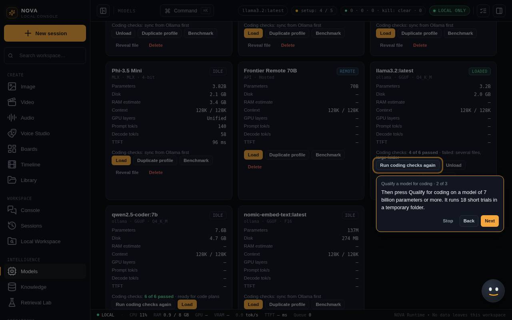
### What it will not do

The helper explains and shows; it never presses buttons, changes settings or touches files itself. If it is not sure, it says so and suggests Help & Support. It runs on your local model, so an answer takes a second or two while the face shows it is thinking.

### Design Nova's look and personality

Press ⚙ in the helper, then **Design look & personality…**. The same designer opens from **Look & personality…** in [Voice Studio](#voice-studio) for any character.

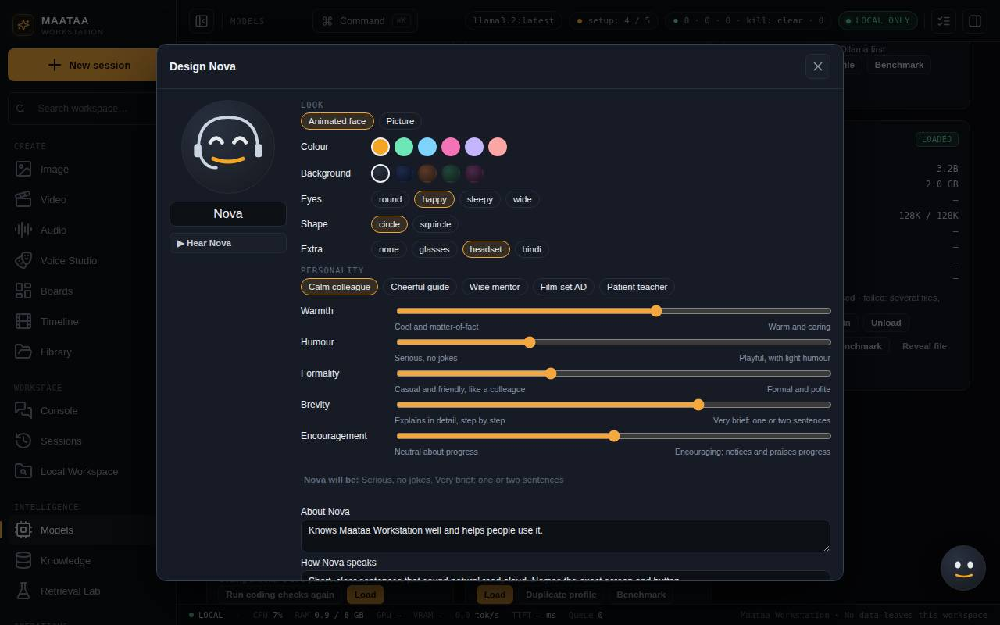
**Look**
- **Animated face:** choose a colour, a background, eyes (round, happy, sleepy, wide), a shape (circle or squircle) and an extra (glasses, headset or bindi). The face blinks, looks up while thinking, and its mouth follows the voice.
- **Picture:** press **Make a picture** to draw a portrait with ComfyUI from the name and personality (add a description if you like), or **Upload** your own. While Nova speaks, the picture moves with the voice.

**Personality**
- Start from a preset: **Calm colleague** (the original), **Cheerful guide**, **Wise mentor**, **Film-set AD** or **Patient teacher**.
- Fine-tune five sliders: **Warmth**, **Humour**, **Formality**, **Brevity** and **Encouragement**. The line under the sliders shows how Nova will come across. A slider in the middle says nothing either way.
- Add **About Nova** and **How Nova speaks** in your own words, the language, and the usual delivery (calm, warm, joyful and so on).
- **▶ Hear Nova** plays a sample in Nova's voice. The voice itself is chosen in Voice Studio (the usual app voice by default).

Press **Save**. **Reset to original** brings back the original Nova. Nova is built in, so it cannot be deleted. Traits change tone and wording only, never facts, safety rules or what the helper may do.

### Settings

Press ⚙ in the helper:

| Setting | What it does |
| --- | --- |
| Read answers aloud | Speak answers and walkthrough notes (on by default) |
| Tell me when something needs attention | Off by default. When on, the helper mentions only real changes: ComfyUI stopped and could not restart, Maataa was halted, or coding checks finished |
| Helper character | Nova (as you designed it), or a [Voice Studio](#voice-studio) character's name, face, personality and voice |
| Hide the helper | Removes the face. Bring it back in **Settings > Helper** |

## Chat and sessions

*Talk to a local model, attach images, cite your documents, make media from chat, and keep conversations organised.*


### Send a message

1. Press **New session** (or pick one on the left).
2. Check the model in the model pill at the top right. Click it to choose another synced model.
3. Type in the box at the bottom and press Enter (Shift+Enter adds a line), or hold the **microphone** and speak. Maataa shows what it is doing step by step above the answer, then the answer streams in. The line under it shows how long the first words took, the speed and the length.
4. Press the stop button that replaces send to stop a reply. You can type your next message while Maataa is still answering: it is queued and answered next.

If the selected model is an example record, or Ollama is not running, Maataa says so instead of inventing a reply. **Settings > Demo mode** allows clearly labelled simulated replies for trying the interface.

### Options under the message box

- **+**: add files, a folder, a web page or a git repository for Maataa to read, or ask it to look at your screen. Images you add are shown to the model; reading them needs a vision model, for example `ollama pull llama3.2-vision` or `llava`. See [Add sources, live steps, computer and voice](#add-sources-live-steps-computer-and-voice).
- **Computer**: lets Maataa use this Mac in this chat, asking before every action. **Voice**: reads replies aloud.
- **Retrieval**: when on, Maataa searches your Knowledge collections for passages that match your message and gives them to the model. Cited passages appear as chips under the answer with their match score.
- **Profile** (Balanced and your saved profiles): switches temperature, top-p, top-k and repeat penalty in one click. The Inference tab of the inspector shows the exact values.

### Make media from chat

Ask in plain words ("make an image of…", "create a video of…", "write a song about…", "compose background music…", "generate a sound effect of…") or start with `/image`, `/video`, `/song`, `/music`, `/sfx` or `/voice`. Maataa answers with a card: **Generate** runs the job on this computer and shows the result in the chat; **Open in Media** fills in the right Media tab so you can change settings first. An image attached to the message becomes the starting picture. Songs are written by your local model first, then sung by ACE-Step. See [Audio, songs and transcripts](#audio-songs-and-transcripts).

### Fork, snapshot and export

The three buttons at the top of a conversation:

- **Fork** copies the session so you can try a different direction without losing the original.
- **Snapshot** saves the session as it is now.
- **Export** saves the conversation as a file.

### Sessions

**Sessions** lists every conversation. Search, filter by tag, pin the ones you use most, archive old ones and delete what you no longer need. Pinned sessions stay at the top of the Console list. Each row shows the date, number of messages and the model's quantization (for example `Q4_K_M`).

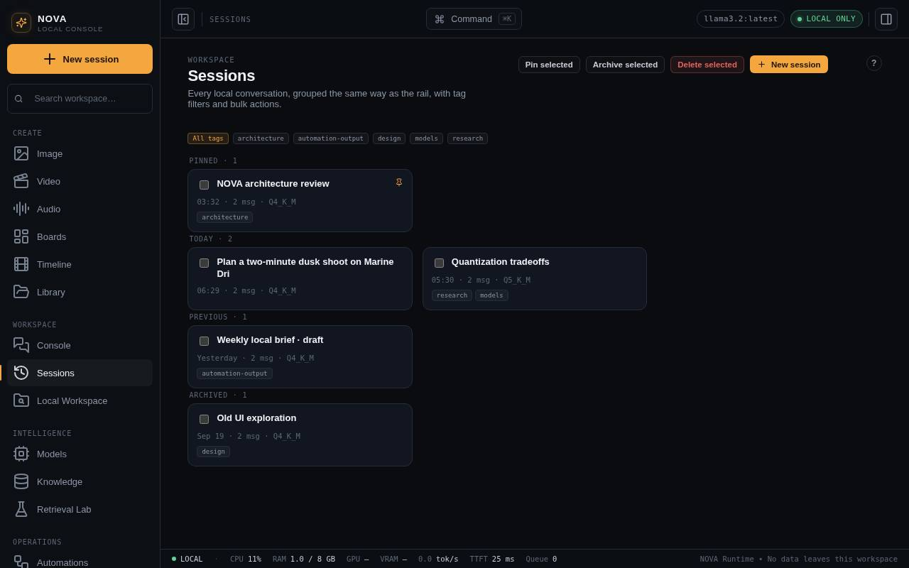
> **Tip** A local model can still be asked to use a tool. Before you use agents or workflows with sensitive files, check which tools they may call; see [Tools and approvals](#tools-and-approvals-mcp-registry).

## Models

*Sync models from Ollama, load and unload them, benchmark speed, and see which models passed Maataa's coding checks.*

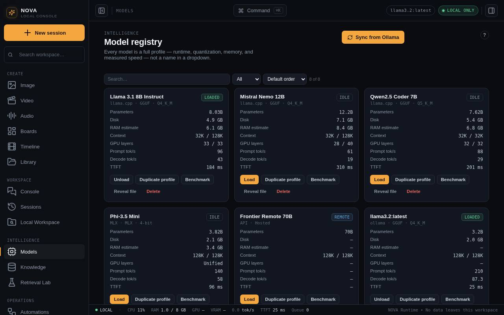
### Get models

Maataa uses the models you have in Ollama. To add one, pull it in Terminal, for example:

```
ollama pull llama3.2
ollama pull qwen2.5:7b
ollama pull nomic-embed-text
```

Then press **Sync from Ollama** in **Models**. Maataa adds or updates a card for each model. The first sync after installing replaces Maataa's example models with your real ones.

### Load, unload and benchmark

- **Load** asks Ollama to keep the model in memory, so the first answer comes faster. **Unload** frees that memory.
- **Benchmark** runs a real generation and records time to first token and tokens per second.
- Values Ollama does not report (for example some GPU figures) show as unavailable rather than estimated.

### Qualify for coding

Code plans (in chat and Local Workspace) and the improve-and-test loop only use models that passed Maataa's coding checks, so a model cannot quietly produce broken edits.

1. Press **Sync from Ollama** so the card knows the model's exact version (its digest).
2. Press **Qualify for coding** on the model's card.
3. Follow the trials in **Activity**. Each card shows **Coding checks: N of 6 passed**, and which failed.

There are six checks, and each runs three times. All 18 trials must pass:

| Check | Passes when the model… |
| --- | --- |
| one file | makes the exact edit asked for in one file |
| several files | edits two files in the right order |
| large folder | finds the right file among many large ones |
| asks when unclear | asks a question instead of guessing on a vague request ("Improve this") |
| stops on timeout | stops cleanly when time runs out, leaving nothing half-done |
| stops on cancel | stops cleanly when cancelled |

- The trials use temporary folders. Your projects are never touched.
- A run takes about 10–30 minutes, depending on the model and your Mac. **Cancel** in Activity stops it.
- Results belong to that exact model version. If you pull a newer version, qualify it again.
- Models of **3.2B parameters or smaller** (for example `llama3.2`) can only plan single-file changes, even when qualified.
- The results count towards step 2 of [the setup checklist](#the-setup-checklist).

### Choosing a model

| For | Try |
| --- | --- |
| Everyday chat | `llama3.2`, `qwen2.5:7b` |
| Code changes, Build with Maataa | 7B or larger, for example `qwen2.5-coder:7b`, after **Qualify for coding** |
| Images in chat | `llama3.2-vision`, `llava` |
| Knowledge indexing | an embedding model such as `nomic-embed-text` |

Larger models answer better but need more memory and are slower. The status bar shows memory in use.

## Knowledge and Retrieval Lab

*Make document collections the models can cite, and test what search returns before you rely on it.*

### Knowledge collections

1. Open **Knowledge** and create a collection with a clear purpose, for example "Product requirements".
2. Add documents: text, Markdown, HTML, PDF and similar text-based files, or paste text. Transcripts from Media can land in a collection too.
3. Maataa splits each document into chunks and makes embeddings with Ollama. Wait for the document's status and chunk count before relying on it.

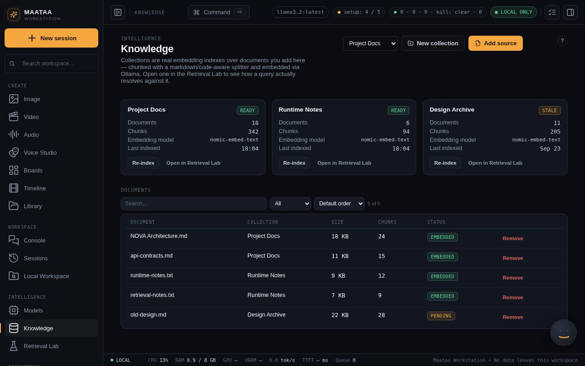
Deleting a document removes it and its index entries. Keep an original copy elsewhere if it matters.

### Retrieval Lab

**Retrieval Lab** shows what a search returns before you use it in chat, an automation or an agent.

- Pick a collection and type a question.
- Each result shows the passage, its rank and score, the source document and a token estimate.
- **Hybrid** combines keyword ranking (BM25) with vector similarity using reciprocal-rank fusion. It is not a cross-encoder reranker.

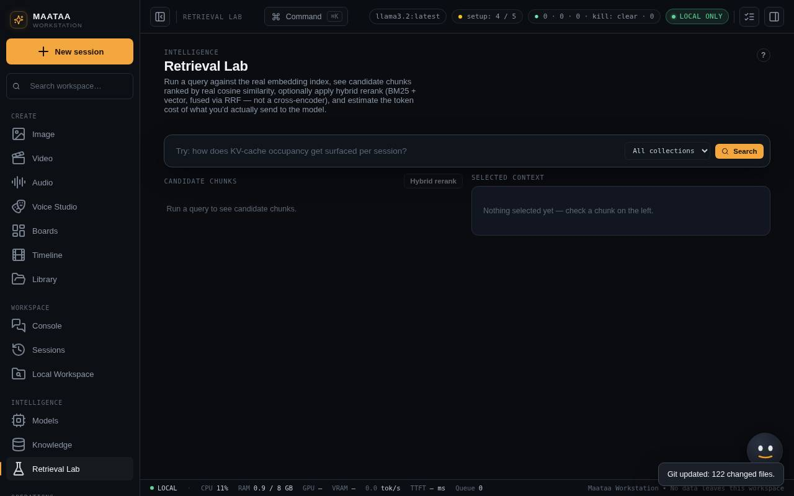
Use it to find missing, badly split or irrelevant material. Results depend on your embedding model and on what the collection contains.

### Using collections in chat

Turn on **Retrieval** under the Console's message box. Maataa adds the best passages to the prompt, and the answer shows them as citation chips. The inspector's **Sources** and **Retrieval** tabs show everything that was retrieved.

## Automations and Evaluations

*Run prompts, skills or workflows on a schedule, and compare models on a fixed benchmark.*

### Automations

An automation runs a prompt, skill or workflow on a schedule (every N minutes, daily, weekly), when a document is added to a collection, or on demand.

1. Create an automation. It starts as **Draft**.
2. Set its prompt or target, trigger, model and knowledge collections.
3. Press **Run now** to test it, and read the output in its run history.
4. **Enable** it once the test does what you want.

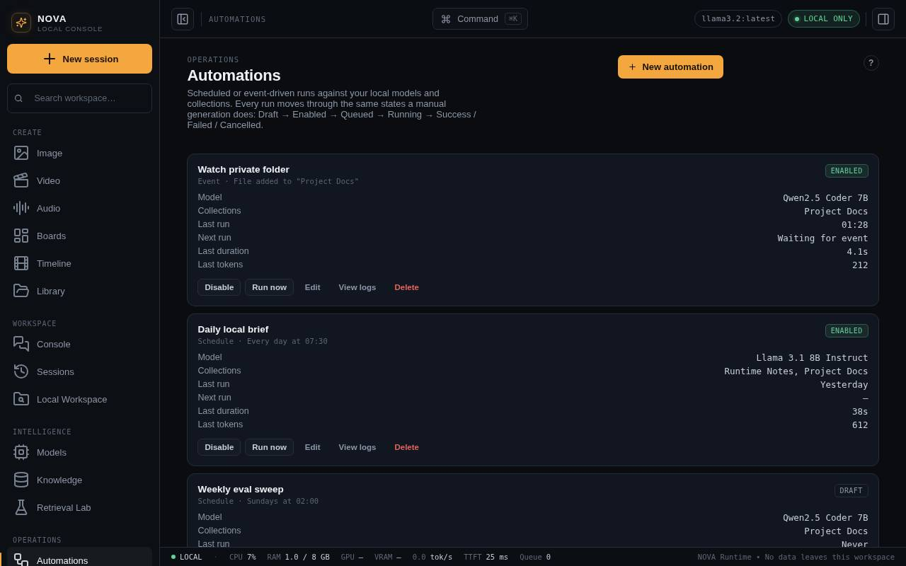
An enabled automation that was due while Maataa was closed runs after Maataa starts. Return it to Draft before changing its model, prompt or collections. Failed and cancelled runs stay in its history.

### Evaluations

**Evaluations** compares models on Maataa's fixed benchmark datasets: accuracy, latency and throughput side by side. Sync the models first, and compare runs that used the same dataset and comparable settings. A score describes that benchmark, not a model's general accuracy or safety.

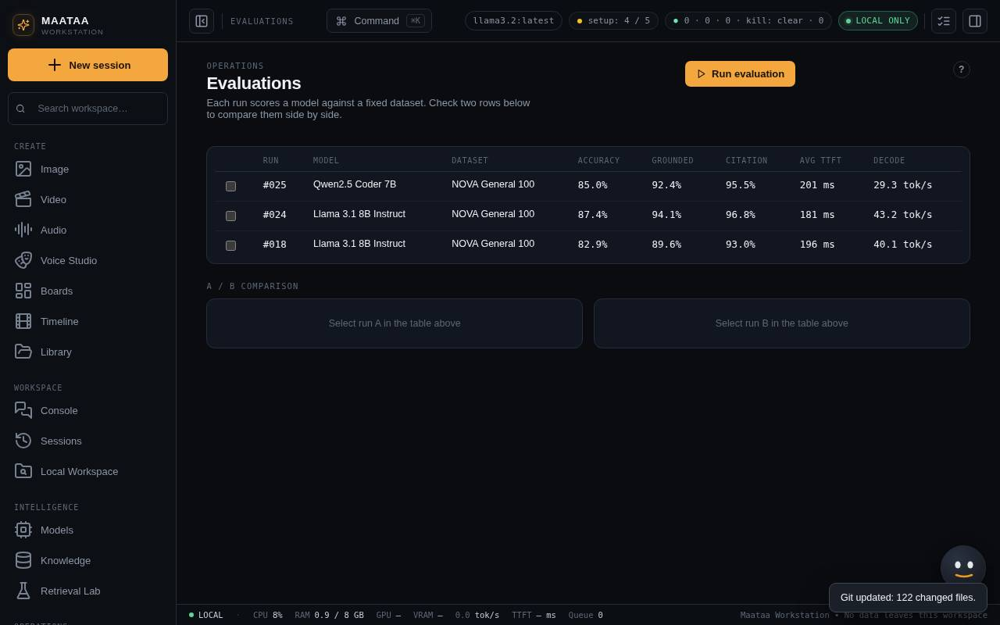

## Add sources, live steps, computer and voice

*Give Maataa a folder, files, a web page or a git repo to read, watch what it is doing step by step, let it use your Mac with your approval, and talk to it out loud.*

Chat in Maataa works like talking to a colleague who can read what you hand them, show you what they are doing, and, when you allow it, use your computer.

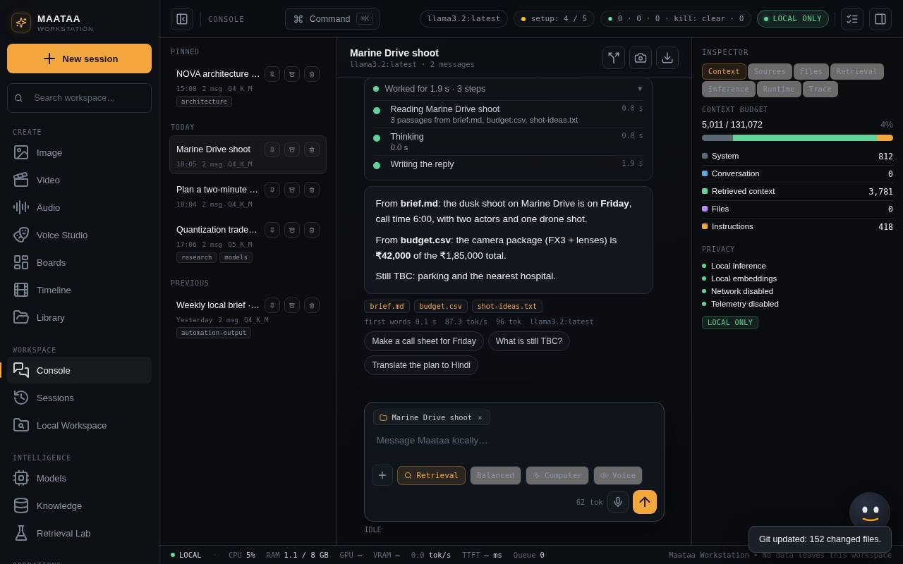
### Add something for Maataa to read

Press **+** under the message box:

| Choice | What Maataa does |
| --- | --- |
| **Add files** | Reads documents, code, CSV, PDF (needs `pdftotext`), Word, PowerPoint and Excel text. Images go to the model as pictures (needs a vision model). |
| **Add folder** | Reads the text files in a folder and its subfolders, skipping `node_modules`, `.git`, build folders and binary files. It never changes the folder. |
| **Add web page** | Fetches the page and keeps its readable text. Needs **Settings > Allow network access**. |
| **Add git repo** | Clones the latest commit (`https://github.com/owner/repo`, `owner/repo`, or the path of a repository on this Mac) and reads it, with its recent history. Remote repositories need network access. |
| **Look at my screen** | Turns on Computer and asks Maataa to take a screenshot and describe it. |

You can also drag files onto the conversation, or paste a link: Maataa offers to read the page or repository.

Ask "scan and report" (or review, audit, check) about an added folder or repository and Maataa also runs its read-only scan (code health, security signals, tests, documentation gaps, duplicate files and git changes) and writes the report from the findings, citing files. Nothing in the folder is changed.

Each thing you add appears as a chip above the message box. While it is being read the chip shows what is happening; when it is ready, ask about it. Maataa picks the passages that match your question and names the files it used under the answer. Remove a chip with **×**. **Inspector > Files** lists what was read.

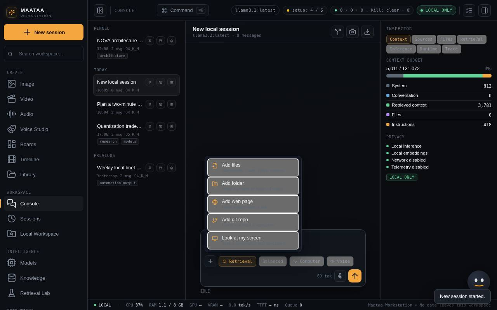
### See what Maataa is doing

Above each reply, a steps panel shows every step as it happens: reading your sources, searching knowledge, thinking, each computer action and its result, writing the reply, with timings. When the reply is done it folds into one line ("Worked for 4 s · 5 steps"); click it to open it again.

The **list icon** in the top bar opens **Activity**: everything running across all chats, such as replies, folders being read and repositories being cloned. Several things can run at once. Stop any of them there. The badge shows how many are running, and turns red when Maataa is waiting for your OK.

You do not have to wait: type the next message while Maataa is answering and it is **queued**, then answered straight after.

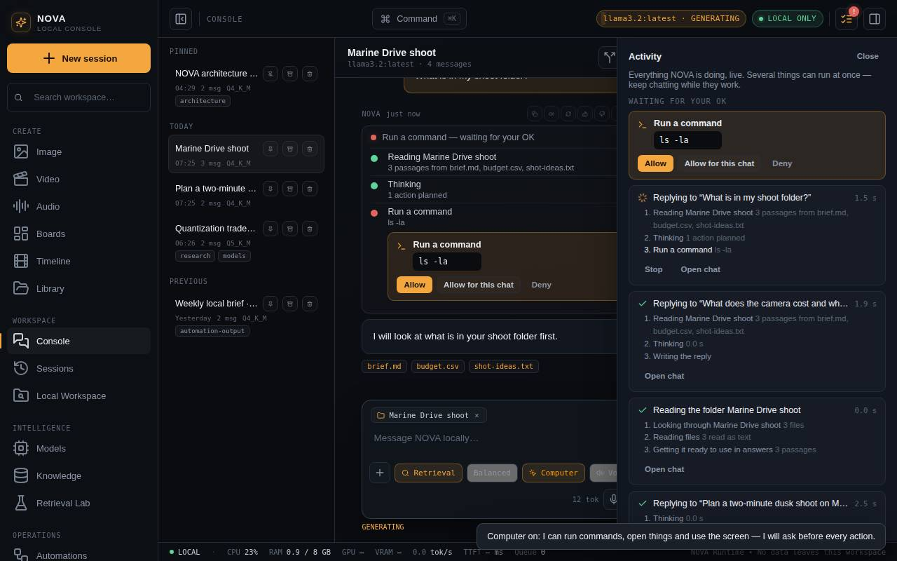
### Let Maataa use your computer

Turn on **Computer** under the message box. It is off in every new chat. Maataa can then:

- **Run commands** in a terminal, inside approved folders: folders you added to this chat and folders approved in Local Workspace.
- **Open** a web link, an app or a file, or show a file in Finder.
- **See and control the screen**: take a screenshot, click, type, press keys and scroll. Reading screenshots needs a vision model.
- **Use the clipboard**, and **list, read, create, move and rename files** in approved folders. It never deletes; **Move to Trash** goes through Finder, so you can put the file back.

If Maataa needs a folder that is not approved yet (for example your Desktop), it asks for it right in the chat: **Allow this folder** approves it and Maataa carries on. You can also type `add folder ~/Desktop` (or `/folder Desktop`, `/url …`, `/git …`) in the message box instead of using the + menu.

Before every action Maataa shows exactly what it wants to do and waits:

- **Allow** does it once.
- **Allow for this chat** allows that kind of action for the rest of the conversation.
- **Deny** tells Maataa not to, and it asks what you would prefer instead.

Some things are always refused: administrator (`sudo`) commands, erasing disks, deleting your home folder, shutting down, and downloading and running a script in one step.

While Maataa is **halted** with the kill switch in [Workbench](#workbench), it does not act on your computer at all. It says so in the chat, and you can still talk to it.

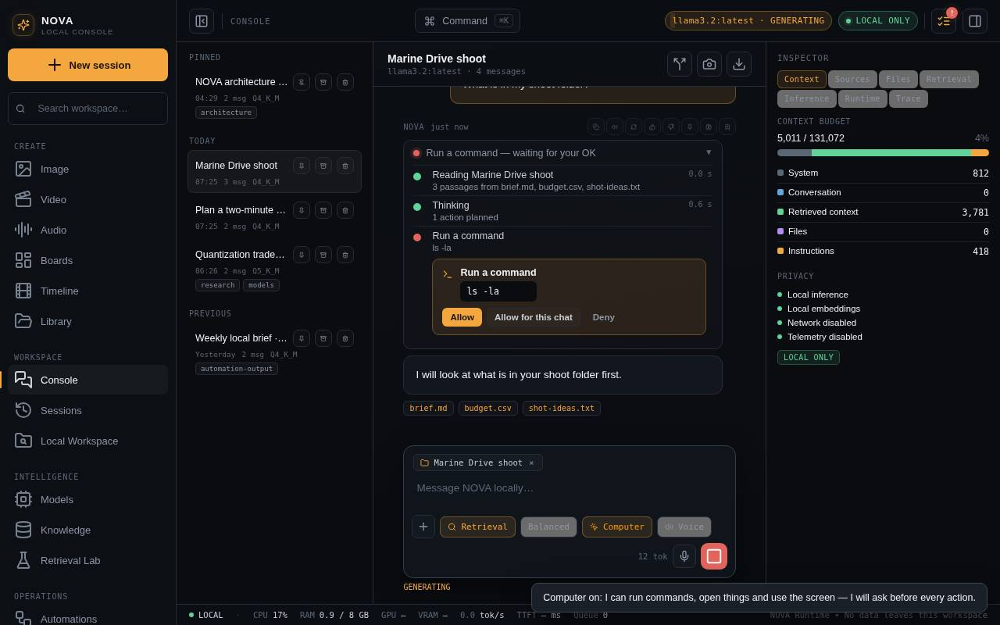
[Video: Adding a folder, asking about it, and approving a command.](../public/help/media/conversation.mp4)
The model must support tools, for example `qwen2.5`, `llama3.1` or `mistral-nemo`. If it does not, Maataa answers anyway and says why it could not act.

**Settings > Computer** can turn computer use off everywhere, turn off screen control, or let read-only actions (looking at files, the screen or the clipboard) run without asking. On macOS, clicking and typing need **System Settings > Privacy & Security > Accessibility**, and screenshots of other windows need **Screen Recording**. Allow Maataa Workstation, or Terminal when you use browser mode.

#### Evidence: what really ran

Under a reply that used the computer, **Evidence** chips list the actions that really ran, for example "Run a command: wc -l shots.txt". The colour shows the result: green for done, red for failed, grey for declined. Click a chip to see its execution contract in **Local Workspace > Execution contracts**.

When a reply says it ran a command or found files but **no action ran**, a red **Not verified** note appears. Any file names, sizes or output in that reply were written by the model, not observed on your Mac. This happens most with small models (for example llama3.2 3B), which often describe an action instead of doing it. For Computer use, pick a model of 7B or more that supports tools (for example qwen2.5), and check that Computer is on.

### Talk and listen

- **Hold the microphone** while you speak and let go to send. Or click it once, speak, and click again. whisper.cpp turns your words into text on this Mac. **Settings > Send right after I speak** decides whether it sends straight away.
- **Voice** reads every reply aloud, using Kokoro voices when installed, else the macOS voice. The **speaker** on any reply reads just that one.

### Edit, retry, react, pin

Hover a message for its buttons:

- **Your message:** ✏ edit it and resend (the later replies are replaced), or copy it.
- **A reply:** copy, read aloud, regenerate, 👍 / 👎, pin (pinned replies are listed under Inspector > Files), remember, or save to Knowledge.
- **Follow-ups:** after a reply Maataa suggests three short follow-ups; click one to send it.

### Pictures: exact text, code and pages

When you add an image (with **+**, by dragging it in, or with **Attach to chat** in Media), Maataa first reads the text in it with text recognition on this Mac — Apple's built-in text recognition, or tesseract elsewhere — and gives the model the exact characters with the layout kept. That makes these reliable:

- "Extract the code from this screenshot" — the code comes back in a code block, indentation included. Even a model that cannot see pictures (such as llama3) gets the text.
- "What does this error say?", "Copy the table in this photo", "Translate this sign".

A vision model (`llama3.2-vision`, `qwen2.5-vl`, `llava`) also sees the picture, for layout, colours and anything that is not text.

**Build a page from a picture.** Attach a screenshot or design and ask, for example, "Build this as a web page" or "recreate this landing page in HTML". Maataa:

1. Writes one self-contained HTML file (no external links, fonts or images).
2. Opens it in a **sandboxed browser** — a throwaway profile with the network blocked — and takes a picture of it.
3. Compares that picture with yours (layout and colour, and the text) and sends the differences back to the model to fix. Up to three attempts; the best one is kept.

The reply shows your image and Maataa's page side by side, how alike they are and how much of the text matched, with **Open page**, **Copy HTML** and, when a folder is added to the chat, **Save to** that folder. Built pages open in a sandbox that cannot reach Maataa or the internet. The check needs Google Chrome, Chromium, Edge or Brave installed; without one Maataa still writes the page but cannot check it.

In **Media**, an image's **Actions** menu has **Copy text in image** and **Build a web page from it**.

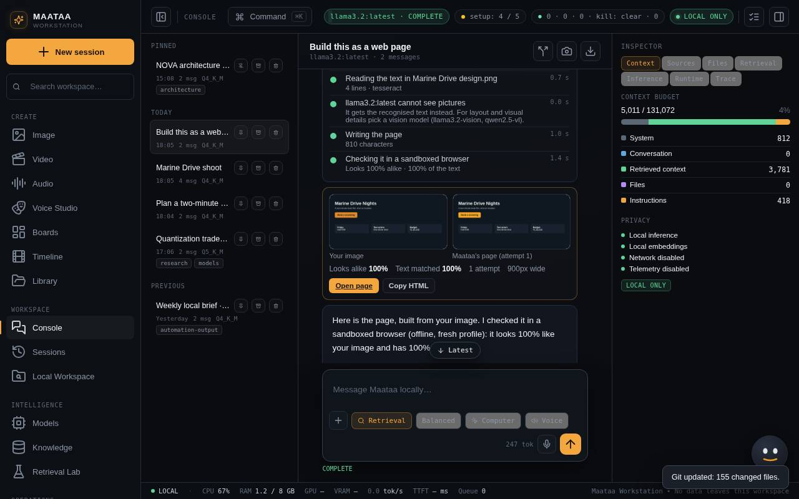
### Memory

Say "remember that I shoot on an FX3" and Maataa saves it; "forget the FX3" removes it. The **brain** button on a reply saves a note from it. Maataa reads your notes at the start of every chat. See, add and delete them in **Settings > Memory**. Nothing is saved unless you ask.

## Images

*Generate and change images on this computer with ComfyUI, keep a character consistent with a LoRA, and edit, expand or upscale any picture.*

Everything in **Media** runs on your computer, and every item keeps the settings that made it (its recipe). Tabs along the top separate **Image**, **Video**, **Audio**, **Transcribe**, **Edit** and **Library**; the panel on the right explains the current tab, lists anything still to install, offers prompt presets and shows that tab's recent jobs with **Cancel**.

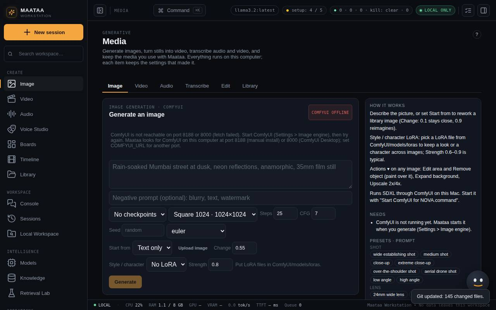
### Set up ComfyUI

1. Open **Settings > Image engine** and press **Install ComfyUI** (or double-click **Install ComfyUI for NOVA.command** in the brahmini folder). It installs ComfyUI in `~/ComfyUI` with the SDXL base checkpoint (about 15 GB) and shows its progress in **Activity**.
2. That is all: you do not need to start ComfyUI yourself.

### ComfyUI is started for you

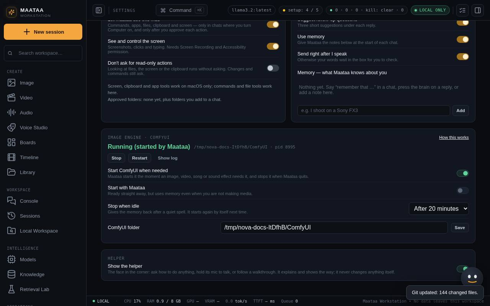
- **Start ComfyUI when needed** (on by default): the first image, video, song or sound effect starts ComfyUI, waits until it is ready and then runs the job. The first job takes about 20–60 seconds longer while ComfyUI loads.
- **Start with Maataa**: ComfyUI is ready straight away, but uses memory even when you are not making media.
- **Stop when idle**: gives the memory back after 10, 20 or 60 quiet minutes; it starts again by itself next time.
- When Maataa quits, it stops the ComfyUI it started, even if Maataa itself is closed suddenly. If ComfyUI crashes, Maataa restarts it, up to three times in ten minutes.
- **Start now**, **Stop**, **Restart** and **Show log** are there when you need them. **ComfyUI folder** points Maataa at ComfyUI installed somewhere other than `~/ComfyUI`.
- A ComfyUI you started yourself, or the **ComfyUI Desktop** app (port 8000), is used as it is and left running when Maataa quits. If only the Desktop app is installed, Maataa opens it when needed.
- Set `COMFYUI_URL` for another local port. Only local addresses are accepted.

Until ComfyUI has started, the Image tab shows **COMFYUI OFFLINE**; generating starts it.

### Generate an image

1. Describe the picture. Click preset chips (shot size, lens, light, style) to add them.
2. Optionally add a negative prompt (things to avoid).
3. Choose the checkpoint, size, steps, CFG, seed and sampler, then **Generate**.

Each image is saved with its prompt, negative prompt, checkpoint and seed. **Reuse settings** loads them back.

**Click an image** to see it full size in Maataa's viewer, with its prompt, model and seed underneath. Use ‹ › or the arrow keys to step through the other images in the list, click the picture to zoom to 100%, **Download** to save a copy, and Esc or **Close** to go back. Images in chat, screenshots from the Agent Browser and character faces open the same way. While ComfyUI works, the **Tensor view** opens at the bottom right and shows each denoising step; see [Boards, Timeline and Library](#boards-timeline-and-library).

### Start from another image

Set **Start from** to a library image, or **Upload image**, describe the change, and set **Change**: 0.1 stays close to the original, 0.9 reimagines it. The source is scaled to about one megapixel first.

### Keep a style or character with a LoRA

**Style / character** picks a LoRA file from `ComfyUI/models/loras` (restart ComfyUI after adding one); **Strength** 0.6–0.9 is typical. It is used for text to image, image to image, Edit area, Remove object and Expand, and recorded in each recipe. A LoRA trained on one character is the most reliable way to keep that character the same across shots. Training your own LoRA is not built in yet.

### Change an existing image

Every library card has **Actions ▾**. The original is never changed; each action makes a new item.

| Action | What it does |
| --- | --- |
| Edit area… | Paint over an area and describe what should be there. Change 0.3 stays close, 1 repaints fully. Only painted pixels change. |
| Remove object… | Paint over something and Maataa fills it with matching background. |
| Expand background… | Puts the picture on a bigger frame (16:9, 2.39:1, 9:16, more room on every side) and paints the new area to match. |
| Upscale… | Makes a 2× or 4× copy. With an upscale model (double-click **Add upscale model.command**, about 64 MB) it adds real detail; otherwise it is a high-quality resize. Limited to 8,192 pixels on the long side. |
| Image to image, Attach to chat, Animate, Filters | Start from this picture elsewhere |

### Filters

**Filters** on any item (or the Edit tab) applies looks (black & white, warm, cool, teal & orange, vintage, high contrast, faded film), film grain, vignette, crops (16:9, 2.39:1, 4:3, 1:1, 4:5, 9:16) and resizing. The result is a new item with its settings in the recipe.

## Video

*Animate stills with camera moves or AI motion (LTX-2 with sound, or Wan 2.2), make video from a prompt, and chain clips together.*

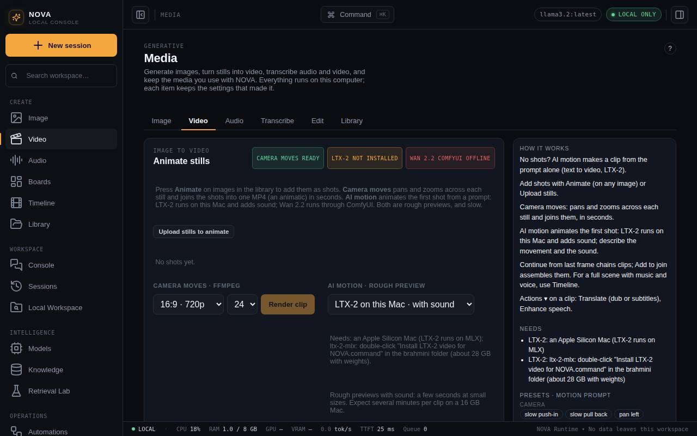
Press **Animate** on any library image, or **Upload stills to animate**, to add shots. Then choose an engine.

### Camera moves

Needs ffmpeg, no AI model. Pick a push in, pull out, pan or tilt and a length for each shot, reorder shots, choose a frame (16:9, 2.39:1 scope, 1:1, 9:16) and frame rate, then **Render**. One shot makes a clip; several make an animatic joined in order. Renders in seconds.

### AI motion with LTX-2 (with sound)

The default on Apple silicon. The first shot and your prompt (describe the motion and the sound, for example "waves crash, gulls call") go to LTX-2 running on this computer, and the clip comes back with sound.

- Install it with **Install LTX-2 video for NOVA.command** in the brahmini folder. It downloads only what Maataa uses: about 28 GB for **Fast** clips. For **Better** clips run `bash scripts/install-ltx-mac.sh --better` in `nova-console` (another 19 GB).
- Clips are 1–8 seconds at up to 960×544. Maataa never lets LTX-2 start a download on its own.
- Set `LTX_MLX_BIN` or `LTX_MLX_MODEL` if you installed it elsewhere.

With no shots added, AI motion becomes **Make video from prompt**: LTX-2 makes the whole clip, with sound, from the prompt alone.

### AI motion with Wan 2.2 (no sound)

Choose it in the AI motion list. It runs Wan 2.2 5B in your local ComfyUI. ComfyUI needs three files (about 21 GB together): `wan2.2_ti2v_5B_fp16.safetensors` in `models/diffusion_models`, `umt5_xxl_fp16.safetensors` in `models/text_encoders` (the fp8 version does not run on Apple silicon) and `wan2.2_vae.safetensors` in `models/vae`. **Add Wan video models.command** fetches them; Maataa lists anything missing. Clips are 1–5 seconds at 24 fps; start at 480p and 2 seconds, because each second can take several minutes on a Mac.

### Memory safety

Image and video models share the computer's memory. Maataa runs one image or video job at a time and unloads chat models (and ComfyUI's models, before LTX-2) when a job starts. On 16 GB Macs it keeps LTX-2 to 480p, 5 seconds and low-memory mode, and it does not start Wan 2.2 on Macs with less than 32 GB (it can freeze and restart the Mac; `NOVA_ALLOW_WAN_LOW_RAM=1` overrides). Avoid running other heavy apps during a clip.

### Continuity and joining

- **Continue from last frame** on a clip saves its final frame as the next shot, so the next AI clip starts exactly where the last one ended.
- **Add to join** on clips, in order, then **Join clips** makes one video.
- Keeping the same character across unrelated shots still depends on your keyframes showing the same character (a LoRA helps; see [Images](#images)).

Videos play in the library, can be downloaded, and keep a recipe. MP4 and MOV uploads are accepted too. For cutting a scene with sound, use the [Timeline](#boards-timeline-and-library).

## Audio, songs and transcripts

*Voices, sound effects, music and songs in Hindi and other languages, transcripts with whisper.cpp, translation and dubbing, and speech clean-up.*

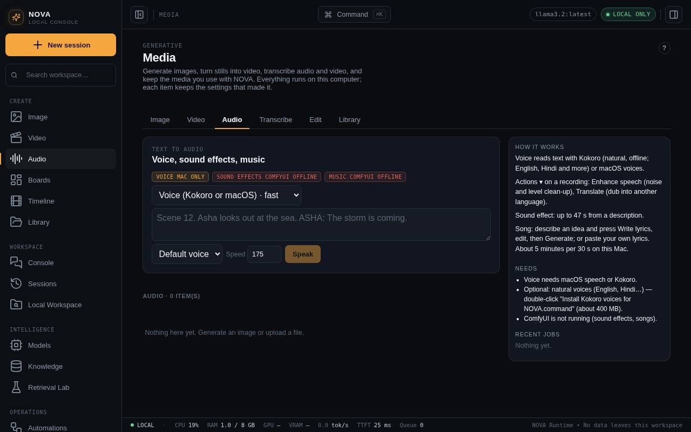
### Voice

**Voice** reads text aloud. It is instant and good for scratch voice-over.

- With **Kokoro** installed (double-click **Install Kokoro voices for NOVA.command**, about 400 MB), Kokoro voices appear first. They sound far more natural and include English (US and UK), Hindi and several other languages.
- Otherwise Maataa uses the voices installed on your Mac. Add more, including Hindi, in **System Settings > Accessibility > Spoken Content > System voice > Manage Voices**.

### Sound effects and music

Both run in ComfyUI and need **Add audio models.command** (about 13 GB).

- **Sound effect** uses Stable Audio Open, up to 47 seconds ("monsoon rain on a tin roof, distant thunder").
- **Music** uses ACE-Step: style tags plus optional lyrics, up to 4 minutes. It needs macOS 15.1 or later.

### Songs

1. Choose **Song / music**, describe the idea (a story, scene or feeling), pick the lyrics language (English, Hindi in Roman or Devanagari letters, Hinglish, Punjabi, Urdu) and a length.
2. Press **Write lyrics**. Your local model writes a title, a style line and [verse]/[chorus]/[bridge] lyrics.
3. Edit anything, then **Generate**. ACE-Step sings it. To sing your own words, paste them in the Lyrics box instead.

**Engines.** Maataa sings with ACE-Step 1.5 (turbo) or ACE-Step 1. With 1.5 installed (**Add ACE-Step 1.5.command**, about 10 GB) it is the default; pick the other in **Engine**. 1.5 also sets the sung language, BPM and key. **Compare 1 vs 1.5** makes the same song with both engines so you can listen side by side. In tests on an 18 GB M3 Pro, 1.5 was about twice as fast, but ACE-Step 1 sang the words more clearly; try 1.5 for drafts and instrumentals, and 1 when the words matter.

### Transcripts

1. Install `brew install whisper-cpp ffmpeg`. If ffmpeg will not install, Maataa uses macOS's `afconvert` for WAV, AIFF, MP3, M4A and FLAC.
2. Put a model such as `ggml-base.en.bin` in `nova-console/data/models/whisper`, or set `WHISPER_MODEL`. For Hindi, Urdu, Punjabi, Tamil and other languages, double-click **Add multilingual speech model.command** (whisper large-v3-turbo, about 575 MB).
3. Upload audio (WAV, MP3, M4A, OGG, FLAC, WebM) or video (MP4, MOV), choose the spoken language or **Detect**, choose a Knowledge collection if you want the transcript searchable, and press **Transcribe**.

Transcripts carry timestamps like `[00:01:02]`. Maataa uses the English model for English (faster) and the multilingual model for everything else.

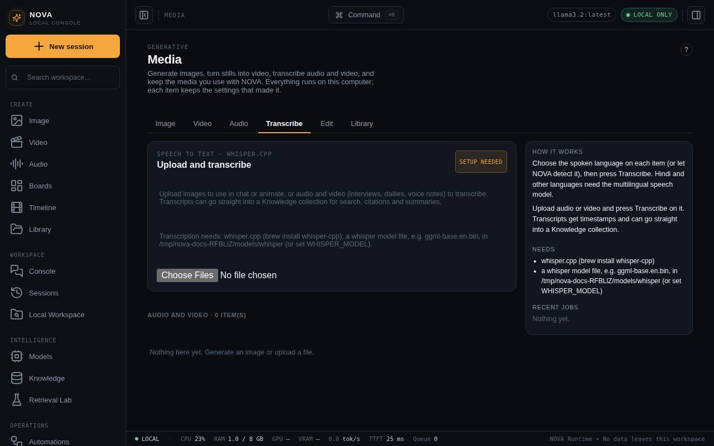
### Translate, dub and subtitle

**Translate…** on an audio or video item transcribes the speech, translates each line with your local model, then either **dubs** it (each line spoken in the new language when the original line starts, over the original sound turned down or off) or, for video, adds **subtitles**. Subtitles are burned into the picture when your ffmpeg has libass; otherwise they are a track you switch on in the player. The translated `.srt` is kept in the recipe. There is no lip sync, and long lines are sped up (at most 1.6×) to fit.

### Clean up speech

**Enhance speech…** removes rumble and hiss, reduces noise, compresses gently and levels loudness to −16 LUFS. **Light** keeps the room sound; **Strong** is for noisy location sound. On video only the sound is redone.

## Boards, Timeline and Library

*Arrange references on boards, cut a scene with sound on the timeline, find everything Maataa makes as files, and watch generation in the Tensor view.*

### Boards

Mood boards, look books and character sheets. Press **New board**, then add **From library** (images and clips), **Upload**, **Note** or **Colour**.

- Drag items to arrange them; drag the bottom-right corner to resize.
- Double-click a note to edit it; Escape or clicking away finishes.
- × removes an item from the board (the library item stays).
- **Save as image** renders the board as a PNG into the library.

Boards save automatically and point at library items, so nothing is copied.

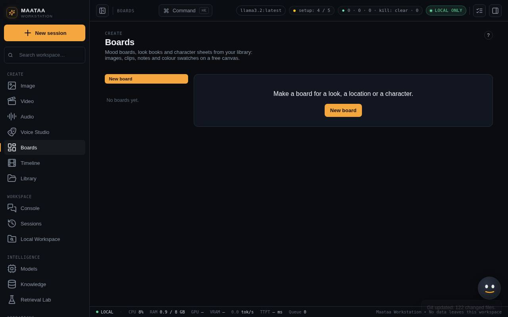
### Timeline

Cut a scene. The **Picture** track plays clips and stills in order; **Voice**, **Music** and **Effects** tracks hold sound that starts at a time you choose.

1. **Add clips** and **Add sound** pick from the library (or use **Add to timeline…** on a library item).
2. Click a block to trim it (**In**/**Out**), set a still's **Seconds**, a clip's **Clip sound** level, or a sound's **Starts at**, **Level** and fades.
3. Drag picture blocks to reorder them and sound blocks to move them in time.
4. Choose the frame size and frame rate, then **Export MP4**. Every shot is fitted to the frame (letterboxed, never stretched) and the sound is mixed. The result lands in the library with a recipe listing every shot and sound.

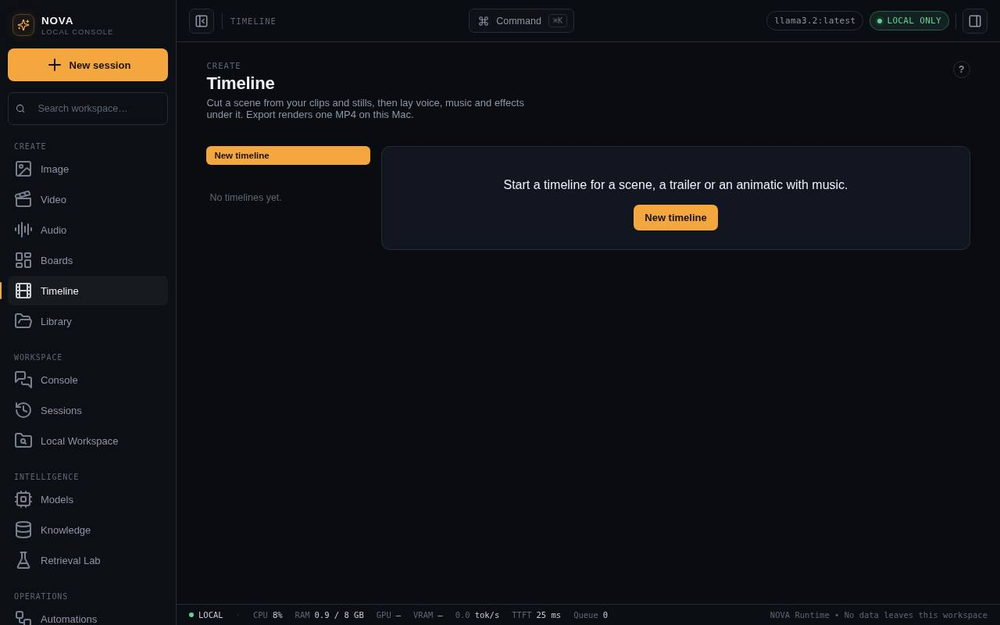
### Library

Every image and video Maataa makes, every transcript and every skill output is also saved as an ordinary file in `~/Documents/NOVA Library`, one folder per day, for example `2026-09-26/1432 marine drive dusk (ltx).mp4`. Next to each file is a `.json` recipe (prompt, model, seed, source, settings), so you can find it in Finder, back it up and reproduce it.

- Change the folder in **Media > Library** (or set `NOVA_LIBRARY_DIR`).
- **Copy earlier items** copies things made before the library existed.
- Your own uploads are not copied. A failed copy never stops a job; the item says so.

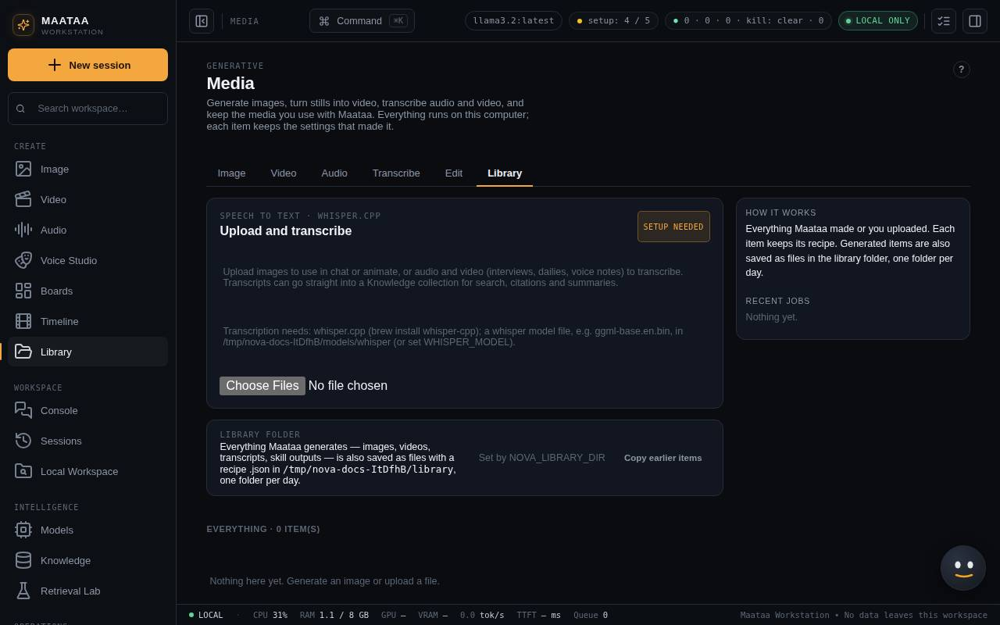
### Tensor view

Whenever Maataa sends a job to ComfyUI (images, edits, upscales, songs, sound effects, ComfyUI video), the Tensor view opens at the bottom right. It shows the stages (load weights, text to embeddings, starting latent, denoise, decode, save) with their times, a picture of the latent after every step, the tensor shapes (for example `[1, 64, 750]` for a 30-second ACE-Step 1.5 song), seconds per step, a film strip from noise to result, and memory in use.

Use ⤢ for a bigger view, – to shrink it, × to close it until the next job. **How this works →** opens a guide to tensors and noise schedules. Images need nothing extra; for songs and sound effects double-click **Add tensor view.command** once. Nothing from the Tensor view is saved, and LTX-2 clips do not appear in it.

## Voice Studio

*Make characters with a personality, a face and a voice, give them to agents, or let Maataa speak as one. Blend Kokoro voices, use macOS voices, or voices from the VoiceStudio app, including your own cloned voice.*

**Voice Studio** (Create group) is where you give Maataa's agents a personality. A character has:

- a name and who they are, for example "Meera, a calm first assistant director"
- a **personality** and a way of speaking
- a **language** to answer in
- a **face**, drawn by ComfyUI
- a **voice**

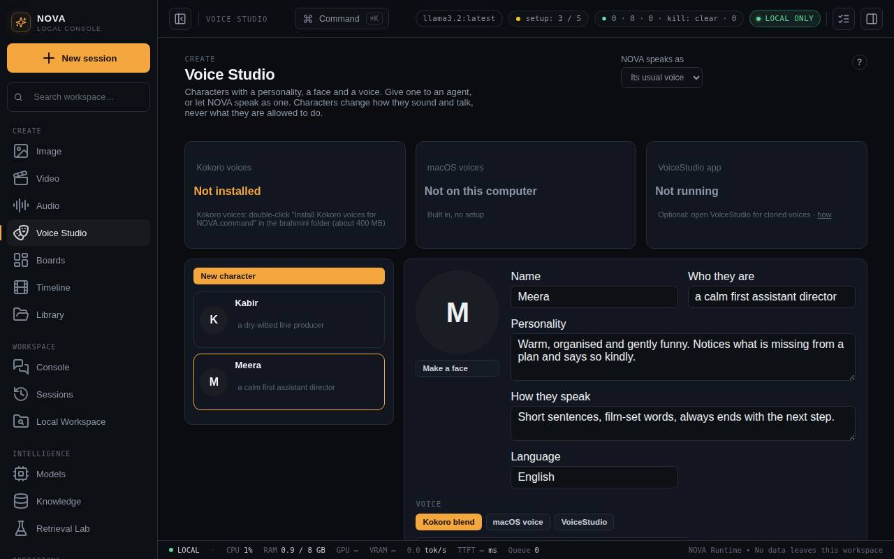
### Make a character

1. Press **New character** and fill in the name, who they are, their personality and how they speak.
2. Choose a voice (below), type something in the preview box and press **▶ Preview** to hear it.
3. Press **Create character**.
4. Press **Make a face**. Maataa starts ComfyUI if needed and draws a portrait from the description. **Remove face** clears it.

### Voices

| Voice | What you get | Needs |
| --- | --- | --- |
| **Kokoro blend** | Mix up to three Kokoro voices by share, for example 70% Heart and 30% Emma, to make a voice of your own without recording anyone. Voices in English (US and UK), Hindi, Spanish, French, Italian, Japanese, Portuguese and Chinese. | Kokoro voices (double-click **Install Kokoro voices for NOVA.command**, about 400 MB) |
| **macOS voice** | Any voice built into macOS | Nothing |
| **VoiceStudio** | Voice profiles from the VoiceStudio app, including designed and cloned voices, in 600+ languages | The VoiceStudio app running |

**Speed** (0.6× to 1.6×) and **Pitch** (six semitones down to six up) work with every voice. Pitch needs ffmpeg (`brew install ffmpeg`).

### Delivery: emotion and mode

A character does not read every line the same way. **Delivery** decides how each part of a line is said: calm, warm, joyful, excited, sad, angry, shouting, whispering, taunting, fearful, laughing or singing.

| Setting | What it does |
| --- | --- |
| **Usual delivery** | How the character normally sounds. Left on Neutral, Maataa takes it from the personality: "gentle and motherly" sounds warm, "playful and sarcastic" taunts |
| **Let the personality choose the delivery for each sentence** | Your local model acts as voice director: it reads the character's personality and what each sentence means, and picks a delivery per sentence, so a scolding is said angrily and a secret is whispered. Without a model, Maataa goes by signs in the text: CAPITALS shout, "!!" sounds excited |

#### Direct a line yourself

Write cues in the text, in square brackets or round ones. Everything after a cue is said that way, until the next cue:

> [warm] Come here, my child. [taunt] Did you really think you could hide? [pause] [sing] La la la…

Cues: `[shout]`, `[whisper]`, `[sing]`, `[taunt]`, `[laugh]`, `[angry]`, `[sad]`, `[joyful]`, `[excited]`, `[calm]`, `[warm]`, `[fearful]` and `[pause]` (a short silence). Words such as `(yells)`, `(sings)`, `(teasing)` or `(sighs)` work too. Click the cue chips under **Delivery** to add them to the preview box. Cues always win; the preview's delivery list sets the rest of the line.

After **▶ Preview**, Maataa shows the deliveries it used, for example "delivered as warm → taunting → singing".

#### How it sounds

- **Kokoro and macOS voices** act each delivery out: each part is spoken at its own speed, then Maataa changes pitch and loudness and adds an effect, such as a compressor for shouting, a breathy filter for whispering, a wobble for taunting, and vibrato with a little room for singing. This needs ffmpeg (`brew install ffmpeg`); without it, a line is said in one delivery, using speed only.
- **VoiceStudio voices** also receive the delivery as an instruction ("speak shouting loudly"), which expressive voice models follow in their own way.
- These voices cannot really sing a melody: singing here is a sung-style reading. For a real song with music, use **Media > Audio > Song**.

### VoiceStudio app

[VoiceStudio](https://github.com/debpalash/VoiceStudio) is a separate, free desktop app for cloning and designing voices. Maataa talks to it over its local service at `http://127.0.0.1:3900` and never sends text anywhere else.

1. Install VoiceStudio from its website and open it.
2. To use your own voice, clone it inside VoiceStudio. It asks for the speaker's permission and adds an inaudible watermark to everything it makes.
3. In Maataa, choose **VoiceStudio** as a character's voice and press **Refresh**; your voice profiles appear in the list.

> **Important** Only clone a voice you have the right to use: your own, or someone who has agreed. VoiceStudio's models have their own licences; check them before using voices commercially.

VoiceStudio is a separate program with its own licence (AGPL). Maataa does not include any of its code; it only uses its local service. If VoiceStudio uses another address, set `VOICESTUDIO_URL` before starting Maataa.

### Give a character to an agent

Tick the agents under **Agents that use this character** and press **Save**. When that agent runs, it starts from the character's personality, way of speaking and language, then its own instructions. Deleting a character returns its agents to their own instructions.

### Let Maataa speak as a character

Choose a character in **Maataa speaks as** at the top of Voice Studio. Replies read aloud (**Voice** under the message box, or the speaker button on a reply) then use that character's voice and delivery, so an excited reply sounds excited.

### What a character cannot change

A character changes tone and wording only. It never changes facts, safety rules, approvals or what an agent is allowed to do, and an agent asked whether it is an AI says so plainly.

## Skills

*Sandboxed tools that do one job well — pre-production writers, Translate, Slides, the Summarizer and developer tools — each with a history of its outputs.*

A skill is a small tool with declared inputs, outputs and permissions. It runs in a sandbox and can use only the tool servers and permissions it declares. Skills can be run by hand, by an agent, or as a workflow step.

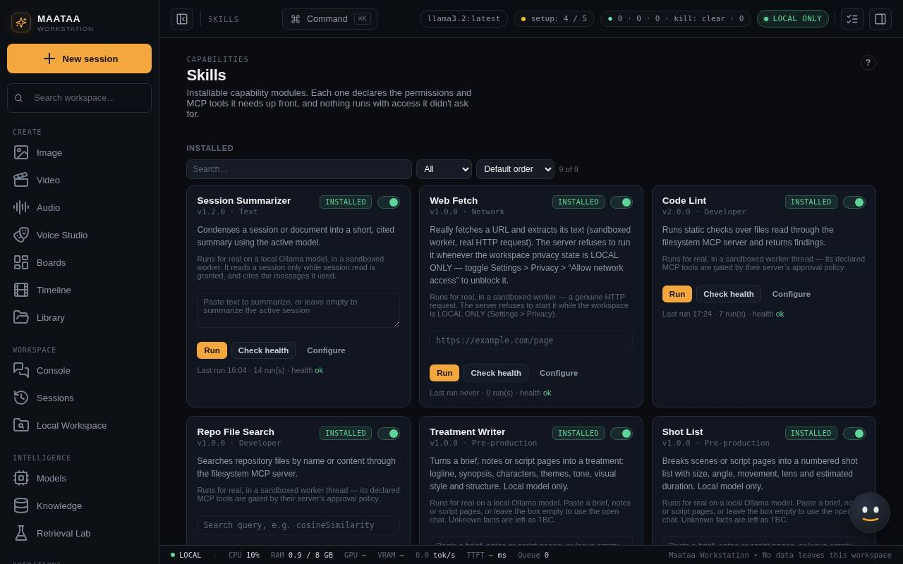
### Skills that do real work

| Skill | What it does |
| --- | --- |
| Treatment Writer | A film treatment from a brief or notes |
| Shot List | A structured shot list (tables); writes TBC for facts not in the source |
| Call Sheet | A call sheet from a schedule or notes; addresses and hospital details stay TBC unless given |
| Translate | Pasted text or the open chat into another language (type it in **Translate into**, e.g. Hindi), keeping formatting, names and screenplay layout; up to about 12,000 characters per run |
| Export to Slides | A deck with speaker notes as Marp Markdown: **Save deck.md**, then open it with the Marp extension for VS Code or `npx @marp-team/marp-cli deck.md --pptx` |
| Session Summarizer | Condenses the open session or pasted text; every sentence cites the source messages; long input is summarised in parts, up to 200,000 characters |
| Code Lint, Repo File Search | Developer tools over an approved folder |
| Web Fetch | Fetches a URL you give it (needs network access on) |

Leave the input box empty to use the open chat. Each skill runs on a local Ollama model and refuses API or demo models where it needs a real one. Skills without a real implementation say so instead of pretending to run.

### Before you enable a skill

- Read its permission list. A skill only gets what its declared tool calls and connected tool servers allow.
- Use its health check and a manual run before giving it to an agent.
- Review Execution History after use.

### History

Every skill keeps a full **History** of its outputs on its card, newest first, with Copy and the library file for each. Outputs are also saved in `~/Documents/NOVA Library`.

### In workflows

A text skill takes the previous step's output as its input. A Translate step names its language in its label, for example "Translate to Hindi". See [Workflows](#workflows).

## Tools and approvals (MCP Registry)

*The tool servers models can call — files, git and a web browser — and how Maataa asks before anything happens.*

Tool servers give models real abilities: reading files, checking git, browsing the web. Maataa starts each server as a local child process and talks to it over the MCP protocol.

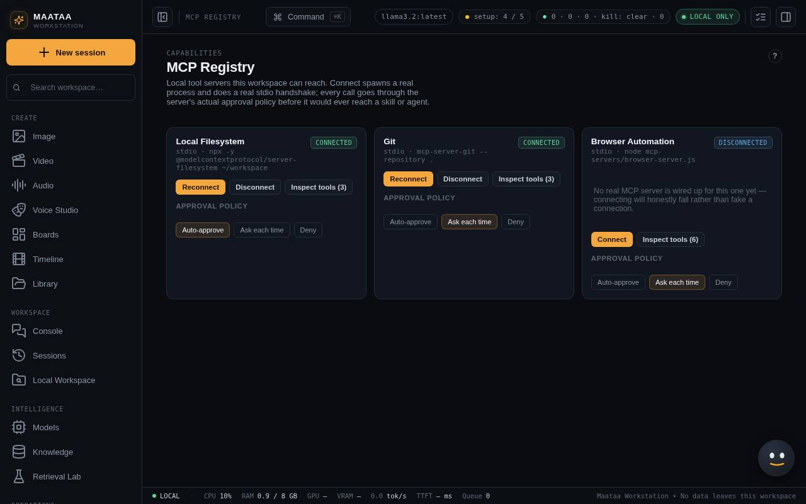
### The built-in servers

| Server | Tools | Notes |
| --- | --- | --- |
| Local Filesystem | list and read files in approved folders | Only paths its policy allows |
| Git | status, log, diffs | Read-only |
| Browser Automation | open a page, read its text, list links, click, type, screenshot | Headless Chromium; connects only while network access is on; http and https only |

### Before you call a tool

1. Check the server shows **Connected**.
2. Read the tool's description and inputs.
3. Check the server's approval policy: **ask** (a person approves each call) or **allow**.
4. Approve only the request you mean to allow.

Pending approvals appear in the MCP Registry and wherever the call came from. Rejecting one stops that call. The same rules apply when an agent, skill or workflow makes the call; nothing bypasses them.

### Good habits

- Disconnect a server you no longer need. Servers do not survive a Maataa restart and must reconnect.
- Keep **ask** on for anything that changes files or reaches the web.
- If Browser Automation reports that Chromium could not start, run `npx playwright install chromium` in `nova-console`.

## Agents

*An agent is a model with instructions and a fixed set of skills and tools. Build one yourself or with Maataa, test it, approve it, and let agents hand work to each other.*

An agent is a local model plus instructions, the skills and tool servers it may use, a memory scope, and a run history. **Run** sends your instruction through a real tool-calling loop against Ollama (up to six rounds): the model can call the agent's skills and tools, approval-gated exactly like the Skills and MCP Registry screens.

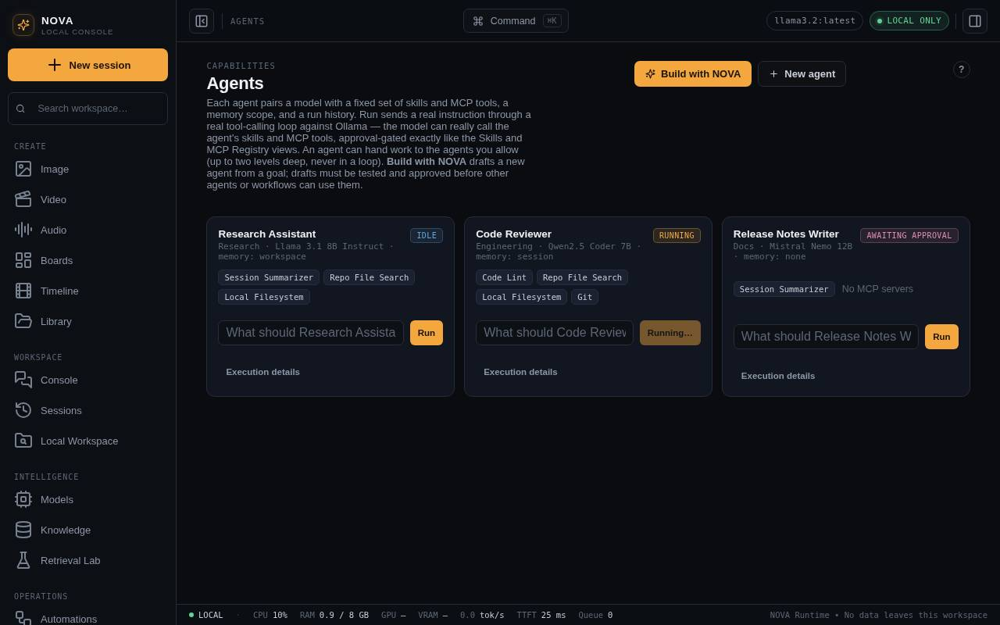
### Build an agent with Maataa

1. Press **Build with Maataa** and describe the goal in a sentence or two, for example "Turn my shoot notes into a call sheet and translate it to Hindi".
2. Pick a local model (7B or larger drafts much better) and press **Draft agent**.
3. Maataa drafts a name, instructions, skills, tool servers and agents to hand work to, choosing only what is installed. Anything else it suggested is dropped and listed in the draft's notes, as are placeholder skills and servers that are not connected. It also writes two or three test prompts.

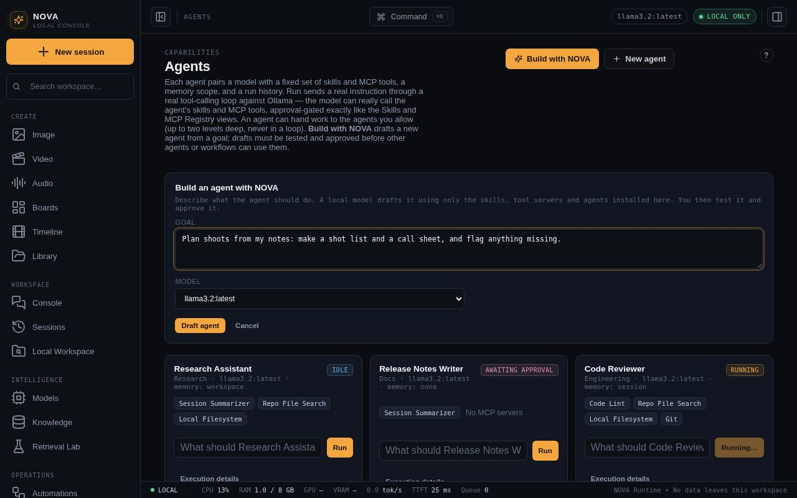
[Video: Drafting an agent from a goal and running its first test.](../public/help/media/build-agent.mp4)
### Test and approve

A new draft is marked **Draft**.

- Click a test prompt (or write your own) and press **Test**. Each test is listed with its result.
- **Approve** becomes available after one successful test.
- **Discard** deletes a draft you do not want.

Until you approve it, a draft cannot be handed work by another agent or run inside an approved workflow. Check its instructions and tools before approving.

### Make an agent yourself

**New agent** opens a form: name, role, model, memory scope, instructions, skills, tool servers, **Can hand work to** (approved agents) and **Can propose new agents**.

### Hand-offs between agents

Agents listed under **Can hand work to** appear to the model as tools. When it uses one, that agent runs with its own model, instructions and tools, and its answer comes back as the tool result.

- Hand-offs go at most two levels deep (set `NOVA_AGENT_MAX_DEPTH` from 0 to 4), never back to an agent already in the chain, and never to a draft.
- Each hand-off is recorded under **Hand-offs received** on the agent that got it.
- The delegate's own tool calls follow the same approvals.

**Can propose new agents** gives an agent a tool to draft a new agent when nothing available fits. What it creates is a draft like any other, labelled as proposed by another agent, and nothing can use it until you test and approve it.

### Execution details

**Execution details** on a card shows the last instruction, the answer, how many rounds it took and every tool call with its result, plus the agent's instructions.

### Agents that work on their own

The agents on this screen run when you ask them. Maataa also has a **multi-agent system** for agents that keep working over time, with their own memory, a shared task list, budgets, tool permissions and a supervisor to escalate to. Its agents appear in Workbench → **Agents**. It is built and tested, but not started from this screen yet. See [Built, not yet in the console](#built-not-yet-in-the-console).

## Workflows

*Chain agents, skills, tool calls and sign-off steps into a repeatable process that survives restarts. Build one from a goal, test it and approve it.*

A workflow is a straight line of steps. Each step gets the previous step's output:

| Step | What it does |
| --- | --- |
| Agent | Runs an approved agent with the step's label as its instruction |
| Skill | Runs a skill on the previous output (for example Summarize, or "Translate to Hindi") |
| Tool | Lists files or shows git status through a connected tool server |
| Approval | Stops until a person presses **Approve** or **Reject** |

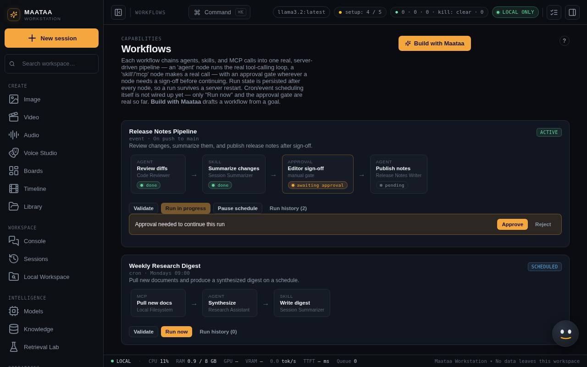
### Run a workflow

Press **Run now**. The server steps through the workflow and saves progress after every step, so a run keeps going if you close the window and resumes after a Maataa restart (the step that was running starts again). At an approval step the card shows **Approval needed**: **Approve** continues, **Reject** stops the run. **Validate** checks that every step points at something that exists. **Run history** lists past runs.

[Video: Drafting a workflow with Maataa, test-running it and approving the sign-off step.](../public/help/media/workflow-approval.mp4)
### Build a workflow with Maataa

1. Press **Build with Maataa** on Workflows and describe the job from start to finish, for example "Summarise the new documents, get my sign-off, then translate the digest to Hindi".
2. Maataa lines up steps from installed agents, skills and the Filesystem or Git servers, drafts a new agent for any step nothing installed covers (up to three), and is told to put a sign-off before anything that publishes, sends, deletes or changes files.
3. The draft is marked **Draft**. **Test run** runs it; a successful test run also counts as a test of the draft agents in it.
4. Approve those agents on Agents, then **Approve workflow**. **Discard draft** removes the workflow and the draft agents it created; approved agents are kept.

### Limits

- Schedules (cron or events) shown on example workflows are not wired up yet; use **Run now**, or an [automation](#automations-and-evaluations) to run a workflow on a schedule.
- A restart cannot fix an unavailable model, a disconnected tool server or a rejected approval.
- Treat any step that publishes, deletes or changes files as a place for a sign-off step.

## Neuron Factory

*Train very small, single-purpose models on this computer — a tiny neural network from examples, or a simulated quantum circuit — then check their quality and approve them.*

**Neuron Factory** (Capabilities) trains very small models that do one job each, entirely on this computer. It does not train or change your Ollama models.

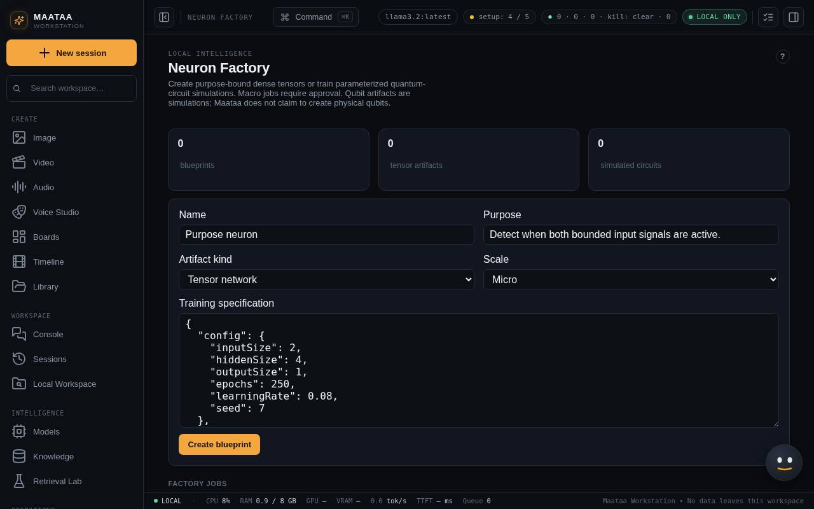
### Two kinds

| Kind | What it is | What you give it |
| --- | --- | --- |
| Tensor network | A tiny neural network (one hidden layer) trained on your examples | Input size, output size, and pairs of input and target numbers |
| Qubit circuit simulation | A simulated quantum circuit trained to produce a pattern of outcomes | The number of qubits and layers, and the target probability of each outcome |

> **Important** Qubit circuits are simulations on your Mac's processor. No real quantum hardware is used, and each result says so.

### Make one

1. Give it a **Name** and a **Purpose** (8 to 500 characters, saying what it is for).
2. Choose the **Artifact kind** and the **Scale**.
3. Edit the **Training specification**. Changing the kind fills in a working example (for a tensor network, it learns "both inputs on").
4. Press **Create blueprint**, then **Queue training** on its card.

Training runs in the background, so you can keep using Maataa. The card shows the job's progress, then the result, including its **final loss** (how far the outputs are from the targets: lower is better).

### Scale

| Scale | Limits | Approval |
| --- | --- | --- |
| Micro | up to 256 examples, 300 training rounds, 16 values wide, 4 qubits | Not needed |
| Macro | up to 2,048 examples, 1,200 rounds, 64 values wide, 8 qubits | **Approve macro job** before it can train |

### Check and approve the result

1. **Evaluate quality** checks the result against a bar: final loss at most 0.08 for a tensor network, or 0.05 for a qubit circuit.
2. If it passes, **Approve artifact** marks it ready to use. Approved results cannot be changed; train a new one instead.

A result that fails the check stays unapproved, and you can change the specification and train again.

### Good to know

- If Maataa restarts while a job is training, the job is marked **interrupted** and the blueprint can be queued again.
- While Maataa is halted with the kill switch in [Workbench](#workbench), new training is refused.
- Blueprints, results and evaluations can only be changed by Maataa itself, not through the general data interface.

## Collector, Capability Graph and Provider Browser

*See the Brahmini collector's runs inside Maataa, map how everything connects, and open hosted AI providers in a separate window.*

### Collector

**Collector** shows plans, runs and evidence from the separate Brahmini Knowledge Collector app (a Next.js app in the same repository) and venue observations it recorded. It is read from that app's data; running the collector itself happens there.

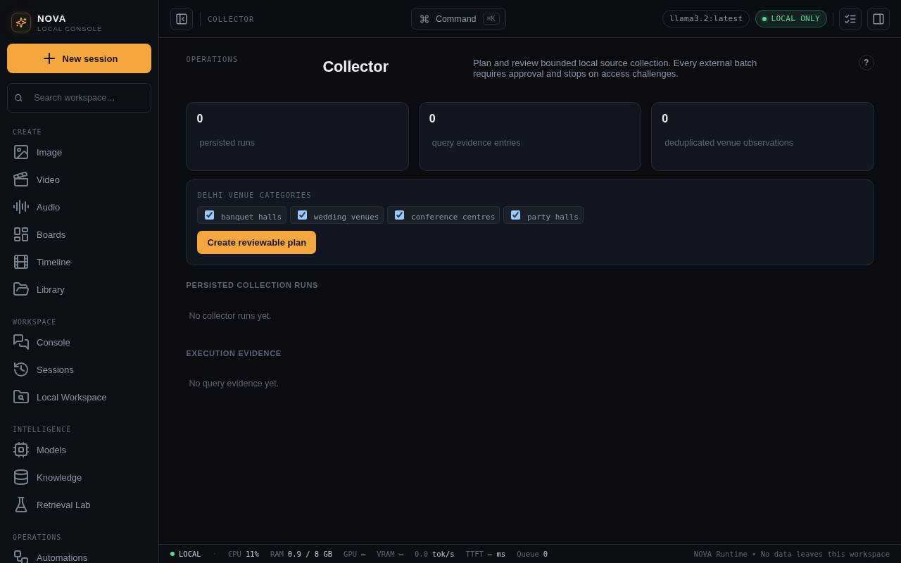
### Capability Graph

**Capability Graph** draws which workflows use which agents, and which skills and tool servers each agent may use. Use it to check what an agent can reach before you run it.

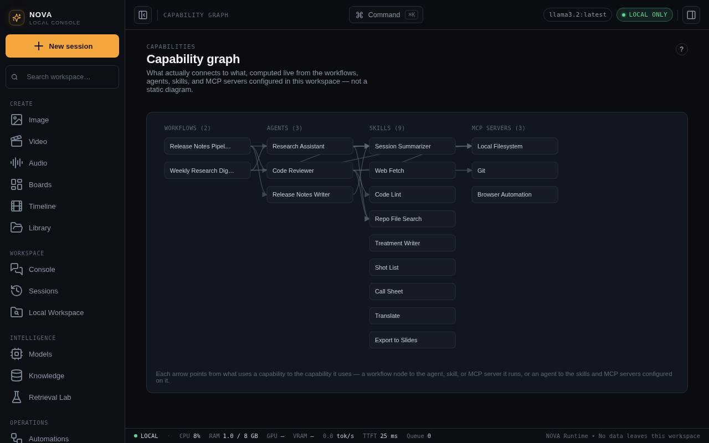
### Provider Browser

**Provider Browser** opens Claude, ChatGPT, Gemini, Perplexity or another HTTPS site in a separate NOVA-owned window.

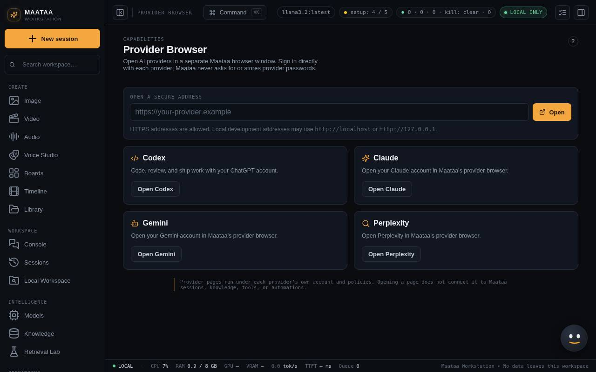
- Pick a provider card or type an HTTPS address. Local development pages at `http://localhost` or `http://127.0.0.1` also work.
- Sign in directly on the provider's page. Maataa does not see or store that password, session or key.
- The provider page stays apart from your Maataa sessions, knowledge, tools, agents and automations. Copy material across deliberately when you want to.

## Workbench

*One page that shows what Maataa is running, what is waiting for your decision, what it may do, what broke and what it produced, with the kill switch.*

**Workbench** is the oversight page for Maataa's background work: jobs, agents, connectors and automatic fixes. Open it from **Workbench** in the sidebar, or click the status strip in the top bar. It refreshes every 3 seconds.

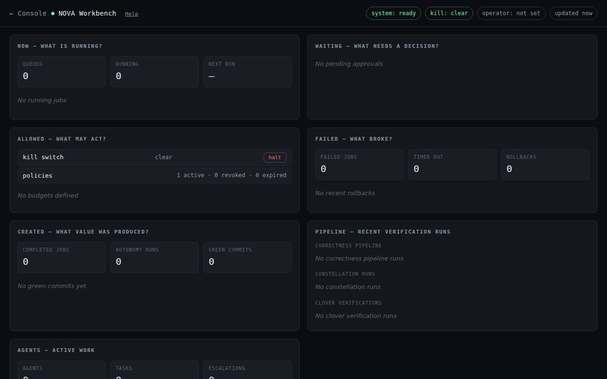
### The status strip

The strip next to the setup pill reads like **0 · 0 · 0 · kill: clear · 0**. In order:

1. jobs queued
2. jobs running
3. items waiting for your decision
4. the kill switch: **clear**, or **HALTED** in red
5. jobs finished

Hover over it for the same numbers in words, and click it to open Workbench. The dot turns red when Maataa is halted or something needs attention.

### The panels

| Panel | Question it answers | What you can do |
| --- | --- | --- |
| Now | What is running? Queued and running jobs, and when the next one starts. | **cancel** a running job |
| Waiting | What needs a decision? | **apply** or **discard** a quarantined change; **approve** or **deny** a connector action; review a policy refusal |
| Allowed | What may act? The kill switch, policies (active, revoked, expired) and budget use. | **halt** or **resume** Maataa |
| Failed | What broke? Failed and timed-out jobs, and recent automatic rollbacks. | — |
| Created | What was produced? Finished jobs, known-good versions and approved autonomy runs. | — |
| Pipeline | Recent verification runs and their result. | — |
| Agents | Agents from the multi-agent system, their tasks, budgets and escalations. | — |

A panel that has nothing to show says so. On a new install most panels are empty until background work runs. See [Built, not yet in the console](#built-not-yet-in-the-console) for which parts of Maataa put work here today.

### Your name in the audit trail

The first time you act in Workbench, Maataa asks for your name. It is written next to every decision (who cancelled, approved or halted, and why) and remembered on this computer. The **operator** pill shows it.

### Approvals

- A **quarantine** is a change Maataa set aside instead of keeping, for example after an automatic fix failed its checks. **apply** keeps it; **discard** drops it.
- A **connector action** is something a connector wants to do outside Maataa, such as opening a pull request on GitHub, that its policy says needs a person. **approve** runs it once; **deny** refuses it.
- A **policy denial** is a record that a policy refused something in the last hour. It is there to read; nothing needs doing.

Every decision asks you to confirm, and is written to the audit log.

### The kill switch

**halt** stops Maataa's background work at its next safe point:

- background jobs and autonomy runs
- agents in the multi-agent system
- the agent browser (it closes every open page)
- computer actions from chat (running commands, clicking, typing, changing files)

Chat itself keeps working, so you can still ask questions while Maataa is halted.

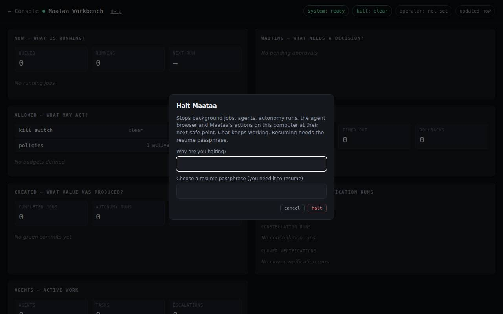
**resume** needs the **resume passphrase**, so something that halted Maataa cannot quietly undo it:

1. The first time you halt (or resume), Maataa asks you to choose a passphrase of at least 6 characters.
2. After that, **resume** asks for that passphrase and a reason.

Maataa keeps only a scrambled (hashed) copy of the passphrase, in the data folder. On a server you can set `NOVA_RESUME_CREDENTIAL` instead, before starting Maataa.

> **Important** Write the passphrase down. If you lose it, see "I lost the resume passphrase" in [Troubleshooting](#troubleshooting).

### Related

- [Policies, budgets and rollback](#policies-budgets-and-rollback)
- [Agent Browser](#agent-browser)
- [The setup checklist](#the-setup-checklist)

## Policies, budgets and rollback

*The rules that decide what Maataa's background work may do — policies, budgets, automatic rollback, quarantine and the kill switch — and the audit trail behind them.*

Maataa's background work (jobs, agents, connectors and autonomy runs) goes through the same set of guard rails. You see their state in [Workbench](#workbench).

### Policies

A policy says who may do what. Every action by an agent, a connector or an autonomy run is checked first.

- **Default is no.** Nothing is allowed unless a policy grants it.
- **A refusal beats a grant.** If one policy allows something and another refuses it, it is refused.
- Policies can expire, and can be **revoked** at any time.
- A policy can say **approval required**. The action then waits in Workbench → **Waiting** until a person approves or denies it.
- Every decision (allowed or refused, and why) is recorded, so you can check later what happened.

Workbench → **Allowed** shows how many policies are active, revoked and expired. Workbench → **Waiting** lists refusals from the last hour.

### Budgets

A budget limits how much something may use per **hour** or per **day**:

| Limit | Counts |
| --- | --- |
| tokens | model tokens generated |
| jobs | background jobs started |
| wall-clock time | how long work runs |
| pull requests | PRs opened through connectors |
| cost | money spent on remote services, if any are used |

When a limit is reached the work stops and waits for the next window. Agents have their own budgets, and a sub-agent's use also counts against its parent. Workbench → **Allowed** shows use against each limit.

### Automatic rollback and quarantine

For areas that change over time (code in the workspace, small trained models, browser tools, releases) Maataa remembers the last version known to be good (the **green** version). When an automatic run fails its checks:

1. Maataa saves what the failed run produced as a **quarantine**, with the reason and the differences.
2. It goes back to the green version.
3. It records the rollback.

You decide later, in Workbench → **Waiting**, whether to **apply** the quarantined change after all or **discard** it. Rollbacks are listed under **Failed**.

This is separate from the rollback you use by hand in Local Workspace (**Roll back batch**), which puts back the files of a change batch you applied yourself.

### The kill switch

**halt** in Workbench stops all of the above at the next safe point, closes the agent browser and stops computer actions from chat. **resume** needs your resume passphrase. See [Workbench](#workbench).

### Execution contracts and evidence

Every action Maataa takes on this computer runs as an **execution contract**: running a command, reading or changing files, taking screenshots, clicking or typing, and applying approved code changes. Each contract records:

- who asked for the action, and from which device;
- the plan and the capability it needs;
- the risk;
- the approval, the result and the checks.

- **This device.** Each Maataa install has its own key, created on first start. The device ID is the key's fingerprint. A device declares what it can do, its capabilities, but a capability is never permission by itself.
- **Approvals fit one plan.** An approval names the exact plan it approves, can be used once, and expires after 10 minutes. If the plan changes, the approval no longer fits and nothing runs. Read-only actions you allowed in Settings are recorded as approved by policy.
- **Evidence.** When a contract ends, Maataa chains it to the one before and signs it with this device's key. **Local Workspace > Execution contracts** shows this device, its capabilities, recent contracts and whether the chain is verified. **Help & Support > Support report** checks the chain too.

A changed, removed or reordered record shows as **Chain broken**. The check catches changes made to Maataa's data. It does not protect against someone who already controls your user account, because the key lives on this computer.

This is the first step of Maataa Everywhere: later, a paired phone will approve the same contracts with its own key.

### The audit trail

Workbench decisions, policy checks, connector actions, agent browser actions and kill switch events are written to the audit log in Maataa's data folder, with the operator's name and the reason.

### Where these apply today

These rules are built and fully tested. In the console today they show up in Workbench, in model qualification and in the kill switch. Connectors, the multi-agent system and autonomy runs are not started from the console yet, so on most computers the policy and budget lists are still empty. See [Built, not yet in the console](#built-not-yet-in-the-console).

## Agent Browser

*The separate, locked-down browser Maataa's agents use — allow websites, try a page yourself, watch every action and blocked address, and close every page at once.*

The agent browser is how Maataa's agents use websites. It is not your browser: it never sees your bookmarks, history or sign-ins, and each agent gets its own empty profile in Maataa's data folder. Open it from **Agent Browser** in the Operations group of the sidebar.

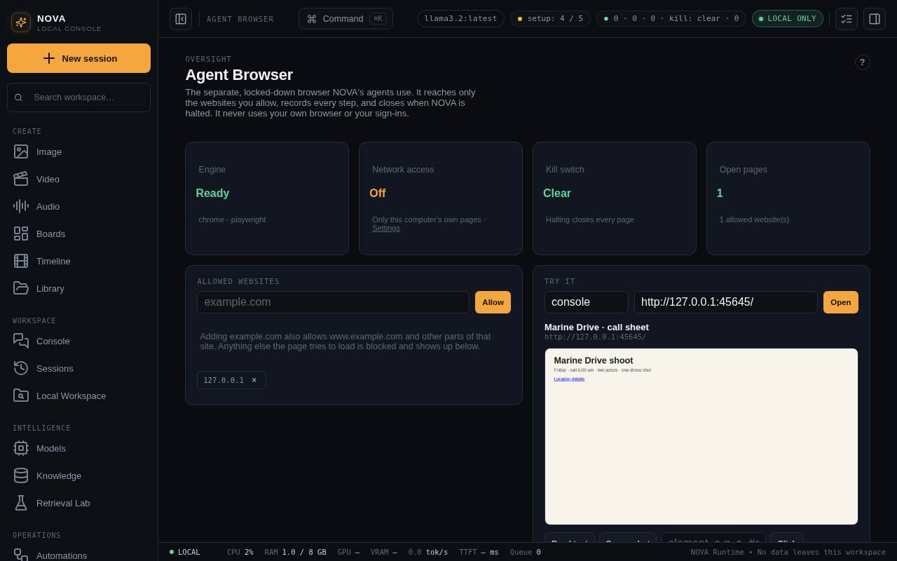
It is different from the two other browsers in Maataa:

- **Provider Browser** (Capabilities) is a window *you* use to sign in to AI providers.
- **Build a page from an image** checks pages in a browser with no network at all.

### The status line

| Card | What it tells you |
| --- | --- |
| Engine | **Ready** shows which browser it drives (your installed Chrome, Edge, Brave or Chromium). **Not available** says what is missing. |
| Network access | Opening internet pages needs **Settings > Privacy > Allow network access**. Pages on this computer itself (`localhost`, `127.0.0.1`) work without it. |
| Kill switch | **Clear**, or **HALTED** with a link to resume in Workbench. Halting closes every agent page at once. |
| Open pages | How many agent pages are open now, and how many websites are allowed. |

### Allowed websites

Agents can open only websites on this list. Type a name such as `example.com` and press **Allow**; the × on a website removes it.

- `example.com` also allows `www.example.com`, `shop.example.com` and other parts of the same site. It does not allow `example.net` or `myexample.com`.
- Everything a page loads is checked: images, scripts and fonts from other websites are blocked unless their website is allowed too. A page can therefore look unstyled until you allow the websites it depends on.
- **Blocked addresses** lists what was refused recently. **Allow** next to one adds it to the list.

### Try it

**Try it** opens a page under exactly the same rules, so you can see what an agent would see.

1. Allow the website first.
2. Enter a web address (and, if you like, an agent name: each name has its own profile) and press **Open**.
3. Maataa shows the page title and a picture of the page. Then:
   - **Read text** shows the page's text. Type an element first (for example `main` or `#price`) to read just that part.
   - **Screenshot** takes a fresh picture.
   - **Click** clicks the element you typed (for example `a` or `#more`), then shows the result.
   - **Type** fills the element you typed (for example `input[name=q]`) with the text next to it.
   - **Close** closes the page.

Password fields are refused unless an agent's policy explicitly allows that website.

### Open pages and activity

- **Open pages** lists every agent page that is open, with **Close** for each and **Close all pages** for all of them. Closing pages does not halt the rest of Maataa.
- **Recent activity** lists pages opened, clicks, typing, reading and screenshots, with the result. What was typed is stored only as a fingerprint (hash), never as text.
- Downloads and uploads need an explicit approval every time, with the exact file named.

### Requirements

- **The desktop app** includes the browser driver (Playwright's core, without browsers of its own) and drives the Chrome already on your Mac. If Chrome is not installed, the Engine card says so; Edge, Brave and Chromium work too.
- **Browser mode** (`npm start`) uses the Playwright package in the source folder.
- Set `NOVA_BROWSER=0` before starting Maataa to turn the agent browser off completely.

The support report shows the engine it found.

## Built, not yet in the console

*Parts of Maataa that are built and tested but not started from the console yet — connectors and the secrets vault, the multi-agent system, the correctness pipeline, autonomy runs and release evidence — and how developers can try them.*

These parts of Maataa are complete and covered by tests. They report into [Workbench](#workbench) and follow the [policies, budgets and kill switch](#policies-budgets-and-rollback). There is no button for them in the console yet. Until there is, developers can run them from Maataa's source folder with the demo scripts below.

### Connectors and the secrets vault

- **Connectors** let Maataa act on outside services. The first one is **GitHub**: check who you are signed in as, read a repository, list and create issues, read and open pull requests, read check results, and merge a pull request.
- Each connector has a profile with **scopes** (what it may do), and can be enabled, disabled or revoked.
- Every action goes through a policy. Actions that need a person wait in Workbench → **Waiting** for **approve** or **deny**.
- Tokens are kept in the **secrets vault**, encrypted with AES-256-GCM. The key is a file in Maataa's data folder that only your user account can read (`.secret-master-key`). Secrets can be rotated and revoked, and are never shown again after saving.

Try it: `node scripts/connector-demo.js`.

There is also a second, simpler GitHub path for Local Workspace. Prepare a pull request draft under **Git delivery** and review it there. Maataa can then open the pull request with the `gh` command-line tool and check its CI results, using a token saved through Maataa's local `/api/secrets` service. The console has no button for that last step yet. The two connector designs will be combined into one. It uses a pretend GitHub unless you set `GITHUB_TOKEN`, `GITHUB_OWNER` and `GITHUB_REPO`.

### The multi-agent system

This is a deeper system than the Agents screen ([Agents](#agents)), built for agents that work on their own over time:

| Part | What it does |
| --- | --- |
| Agent registry | Named roles with instructions, a preferred model, allowed tools and a supervisor |
| Memory | Each agent remembers across runs: private, shared, or visible to its supervisor |
| Tasks | Shared task list; agents hand work to each other |
| Budgets | Limits for each agent; sub-agents count against their parent |
| Tool permissions | Each agent may use only the tools it is given |
| Supervisor | Agents escalate to a supervisor, which approves, denies or forwards the question further up |
| Job bridge | Agent tasks run as background jobs on your Ollama models |

Try it: `node scripts/multi-agent-demo.js`.

### The correctness pipeline

A way to get code that is checked, not just generated:

1. **Several models answer** the same problem.
2. **Tests are written** for it automatically, and answers that agree in behaviour are grouped (semantic voting).
3. The best answer is chosen.
4. Optionally, it is **proved** correct with the Dafny verifier (Clover checks that the code, its description and its proof agree).

Verified results appear in Workbench → **Pipeline**, and count towards step 5 of [the setup checklist](#the-setup-checklist). Proofs need Dafny installed (`brew install dafny`); set `NOVA_DAFNY_BIN` if it is somewhere unusual.

Try it: `node scripts/constellation-demo.js` and `node scripts/clover-demo.js`.

### Autonomy runs

Bounded loops that improve something on their own and keep the result only if it passes:

- **Workspace patches:** apply a patch on a separate branch (`nova/auto`), run the tests, commit if they pass. It never pushes.
- **Small trained models:** train, evaluate, and keep the model only if it beats the acceptance threshold.

Before every step a loop checks the kill switch, its policy and its budget. A failure is quarantined and rolled back. Escalations wait for you in Workbench.

### Release gates

A release counts as ready only when each of these has current evidence on file: test results, the list of built files, code signing, Apple notarisation, a clean install, and the update manifest. Evidence is recorded with a fingerprint of the file. If a file changes or goes missing after it was recorded, the gate fails again.

Check with `npm run release:check` (it exits with an error until every gate passes), or in the app at `/api/release/check`.

### Release evidence

`node scripts/l2-check.js` checks that a release meets Maataa's certification requirements and writes a bundle of the evidence with a fingerprint (hash) of every test result and record, so later changes can be detected. The files in `baseline/` and `docs/release-evidence/` are earlier results.

### Before you run a demo

- Run demos from the `nova-console` folder **with the desktop app closed**. They use `nova-console/data`, the database of the browser development mode (`npm start`), not the app's database.
- Some demos replace their own earlier demo records each time they run.

## Local Workspace and projects

*Approve a folder, let Maataa draft code changes you review and apply in one step, start new projects from templates, run install and dev, and keep a change looping until the tests pass.*

Local Workspace lets Maataa read and change code on your computer, but only inside folders you approve, and only after you review each change.

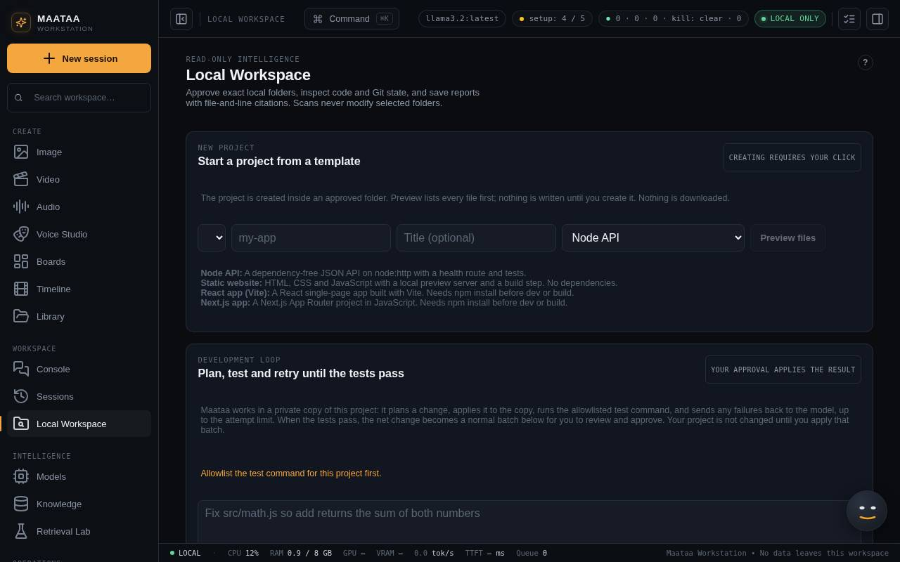
### Approve a folder

Press **Choose folder…**, pick a project folder and press **Approve root**. Maataa can then **Scan folder**, **Search** it and cite files as `path:line`. **Revoke approval** takes access away again. Nothing outside approved folders is ever read or written.

### Code changes

Maataa plans changes only with a model that passed its coding checks: open **Models** and press **Qualify for coding** first ([Models](#models)). Models of 3.2B parameters or smaller can only plan changes to a single file.

Maataa drafts changes from a chat request ("Create src/date.js that exports formatDate") or from JSON you enter. A **change batch** holds up to 50 operations:

| Operation | What it does |
| --- | --- |
| edit | Replaces one exact piece of text in an existing file |
| create | Adds a new file; it must not exist yet |
| delete | Removes an existing file |
| rename | Moves a file to a path that does not exist yet |

- Paths must stay inside the approved folder. Symbolic links and anything in `.git`, `node_modules`, `dist`, `build`, `target`, `.next`, `coverage` or `.cache` are refused.
- **Validate entire batch** tries the whole batch on a copy, so your folder is untouched until you approve.
- **Apply atomically** writes every operation or none. **Roll back batch** puts every file back; it refuses if you edited an affected file afterwards.
- Plans are limited to 2,048 tokens by default. Set `NOVA_PLAN_MAX_TOKENS` (up to 8192) before `npm start` for bigger plans. Small, named changes work best.

### Start a new project

**New project** builds an app from a template in an approved parent folder:

| Template | What you get | Install needed |
| --- | --- | --- |
| Node API | JSON API on Node's own HTTP server, with a health route and tests | No |
| Static website | HTML, CSS and JavaScript with a preview server and build step | No |
| React app (Vite) | React single-page app | Yes |
| Next.js app | Next.js App Router project | Yes |

**Preview files** lists what would be written. **Create project** builds it in a hidden staging folder, runs `git init` on `main`, and moves it into place in one step, then approves the new folder. If your git name and email are set, Maataa makes a first commit.

### Install packages and run the dev server

Commands only run after you approve an allowlist for the project.

- **install** runs `npm ci` or `npm install`. It needs **Settings → Allow network access**. Package install scripts are skipped unless you tick **allow install scripts**.
- **dev** runs the project's `dev` (or `start`) script on `127.0.0.1`, streams the log and shows the address. **Stop dev server** ends it; quitting Maataa stops them all.

### Development loop

Describe a change, pick a local model and up to 5 attempts, and press **Start loop**. Maataa works on a private copy: it runs the tests, asks the model for a plan, applies it, runs the tests again, and feeds failures back until they pass. The result becomes a normal change batch for you to review; nothing changes in your folder until you apply it. **Cancel loop** stops it at any time. The project's `test` command must be allowlisted, and the model must have passed **Qualify for coding**.

A change applied after its checks passed, or a loop that ends with passing tests, completes step 5 of [the setup checklist](#the-setup-checklist).

### Git Updates

**Git Updates** (System group) shows the branch, last commit and changed files of the current workspace, refreshing every 10 seconds. Untick **Auto-refresh** to pause it.

The **Git workflow** panel in Local Workspace works on an approved project, one reviewed step at a time: **Create branch** or **Switch branch**; tick files and **Stage selected files and create draft**; confirm you reviewed the exact staged files, then **Create commit**. Pushing needs **Prepare push review**, **Review exact push** and **Push reviewed commit**, so nothing is pushed without you. **Prepare PR draft** writes a pull request description for you to copy.

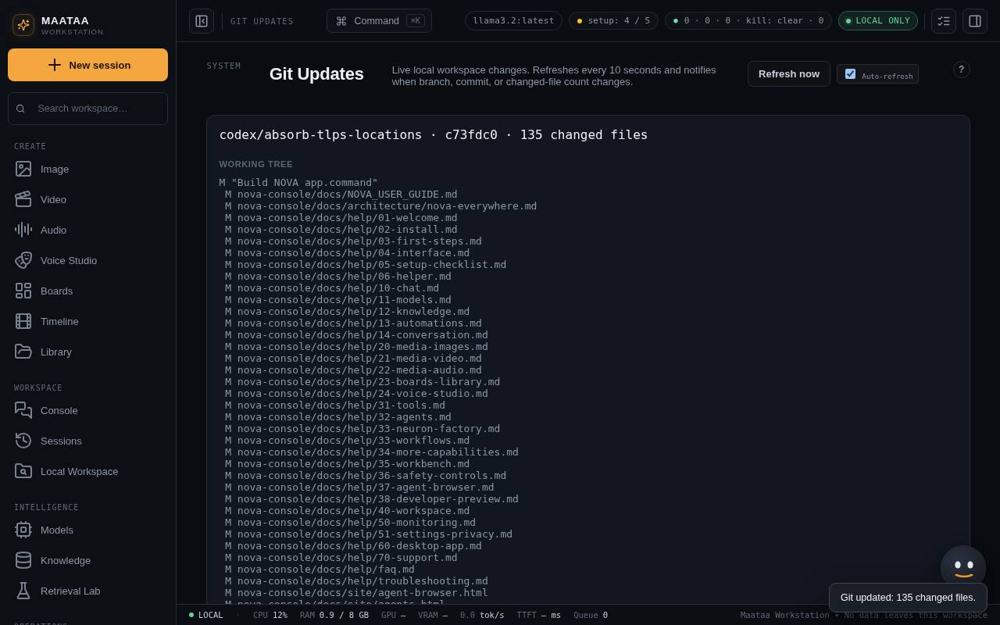

## Diagnostics, Runtime, Trace and History

*Find out what is working and what is not. Diagnostics checks each part, Runtime shows the machine, Trace is the live feed and Execution History is the lasting record.*

### Diagnostics

Open **Diagnostics** first whenever something fails. It checks each part separately, so you can tell a Maataa problem from an Ollama problem:

| Check | What it means |
| --- | --- |
| Maataa Workstation backend | The local server. If this fails, nothing else works. |
| Ollama inference engine | Needed for chat, embeddings, agents and automations. |
| Model loaded | A synced model is selected and ready. |
| Knowledge index | Your collections and their indexing state. |
| Privacy boundary | Whether anything can leave this computer. |
| Automation health and Scheduler | Enabled automations and the timer that runs them. |
| Telemetry loop and Trace buffer | The live counters and activity feed are updating. |

Image, video, audio and transcription engines are checked on the **Support** tab of [Help & Support](#get-help-and-support).

Press **Run diagnostics** to check again. The command palette (**⌘K**) has **Run diagnostics** too.


### Runtime

**Runtime** shows the local service, CPU, memory and, where macOS reports it, GPU use. Some values (thermal state, video memory) are not available on every Mac; Maataa shows "unavailable" rather than guessing.

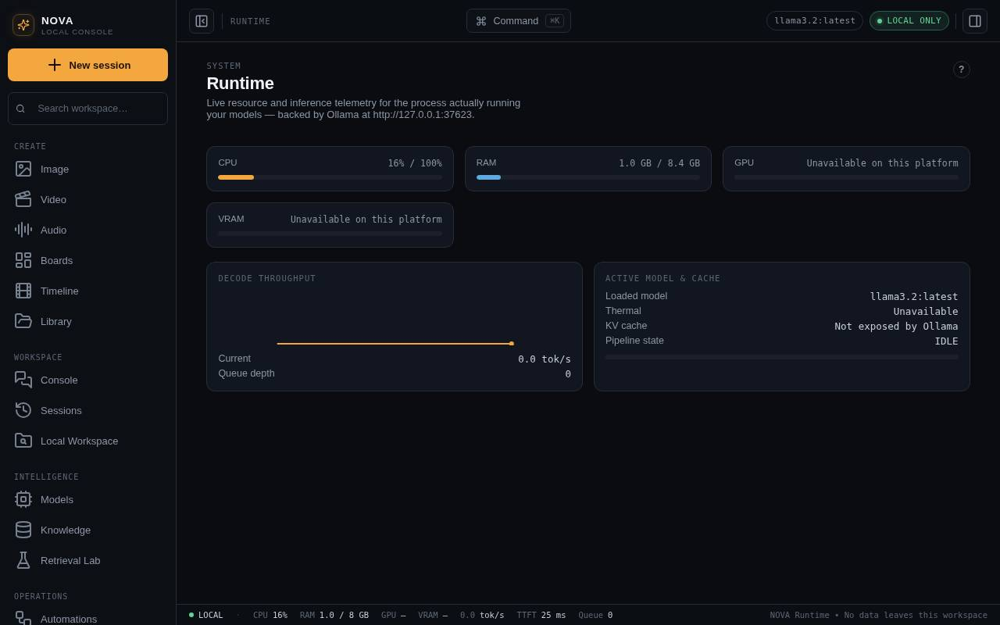
### Trace

**Trace** is a live feed of recent activity: requests, tool calls, agent steps and approvals as they happen. Use it to watch a run in progress.

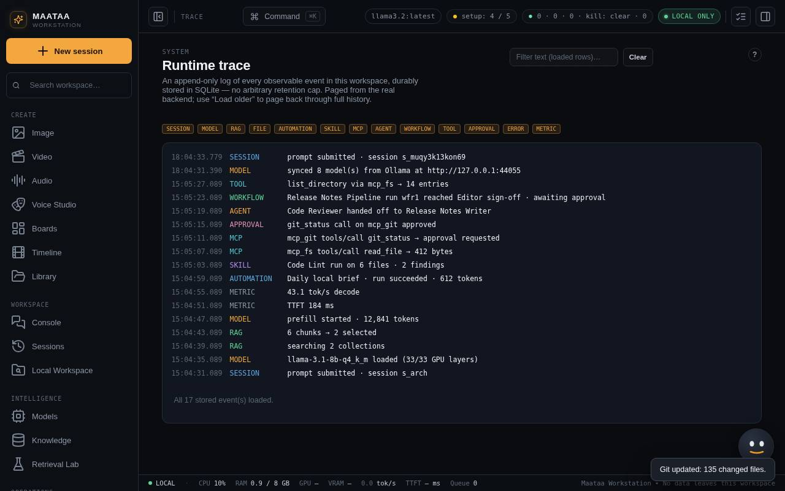
### Execution History

**Execution History** is the lasting record of inference, skills, agents, workflows, approvals and other actions. It is paged from the server, so it covers everything, not only what is on screen. Search, filter by status (for example **failed**) and open an entry to see its input, output, timing and error. A support report includes the most recent failed entries.

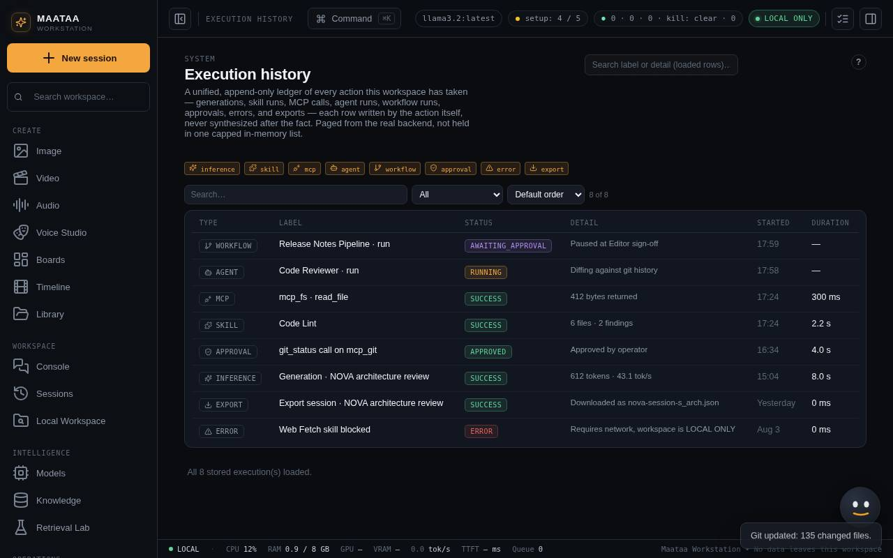
### Status bar

The bar along the bottom shows the backend state, the loaded model and the privacy state (for example **LOCAL ONLY**) at a glance.

## Settings, privacy and your data

*Theme, language, defaults for new sessions, demo mode, network access and the privacy state. Where your data lives, how to back it up and how to reset it.*

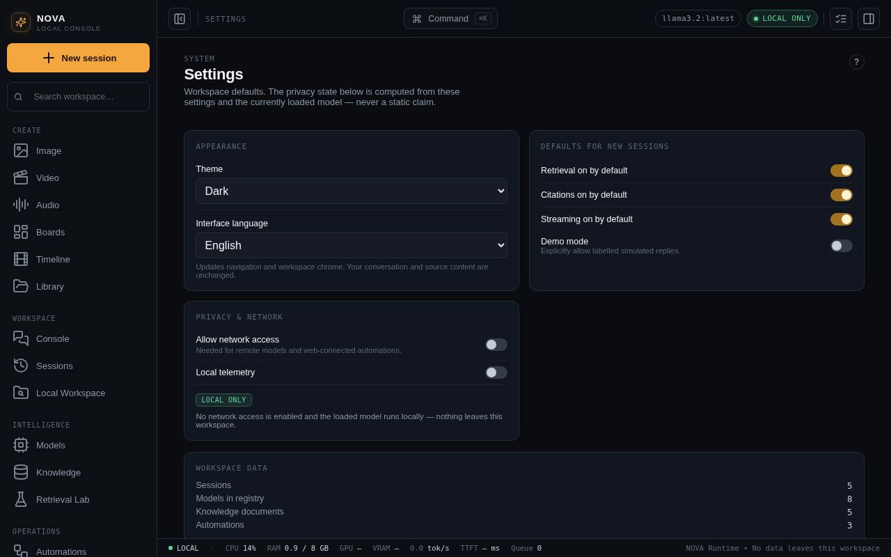
### Appearance

- **Theme**: Dark, Dawn (light) or High contrast.
- **Interface language**: English or हिन्दी (Hindi). Labels change straight away; your content is not translated.

### Defaults for new sessions

Turn **Retrieval**, **Citations** and **Streaming** on or off for new sessions. Each session can still change them in its inspector.

**Demo mode** allows simulated replies when no model is available. They are always labelled as simulated. Leave it off for real work.

### Privacy and network

- **Allow network access** is off by default. Turn it on for things that need the internet: installing packages, web-connected automations, the collector and remote models.
- **Local telemetry** keeps usage counters on this computer only. Nothing is sent anywhere.
- The **agent browser** opens internet pages only while this is on, and even then only websites on its allowed list. See [Agent Browser](#agent-browser).

The privacy badge is worked out from these settings and the loaded model, not written in advance:

| Badge | Meaning |
| --- | --- |
| LOCAL ONLY | No network access and a local model. Nothing leaves this computer. |
| NETWORK ALLOWED | The model is local, but automations and collectors may reach the internet. |
| REMOTE MODEL | The loaded model runs on another service, so prompts go there. |

Maataa's server listens only on `127.0.0.1`, so other computers cannot reach it. The Provider Browser keeps provider sign-ins separate from Maataa and never stores their passwords.

### Where your data lives

| What | Where |
| --- | --- |
| Database (sessions, models, agents, history) | `~/Library/Application Support/com.brahmini.nova-runtime/nova.db` |
| Server log | the same folder, `nova-runtime-server.log` |
| Everything Maataa makes, as files | `~/Documents/NOVA Library`, one folder per day, each with a `.json` recipe |
| Browser development mode | `nova-console/data/nova.db`, or the folder in `DATA_DIR` |
| Workbench history: jobs, policies, budgets, rollbacks, connector requests, agent browser logs | inside `nova.db` |
| Audit log (encrypted, each entry chained to the one before) | the data folder |
| Secrets vault key (`.secret-master-key`) and resume passphrase (`.resume-passphrase`, stored hashed) | the data folder, readable only by your user account |
| Agent browser profiles | the data folder, `browser-profiles`, one per agent |

### Back up and restore

Quit Maataa fully (menu bar item → **Quit Maataa**), then copy the data folder and the Maataa Library. Copy the whole data folder, including its hidden files: without `.secret-master-key`, saved connector tokens cannot be read again. Restore only to the same or a newer Maataa version, with Maataa closed. Keep backups private: they contain your chats, documents and history.

### Reset

**Reset workspace data** (Settings → Workspace data) deletes every record in Maataa's database: sessions, models, documents, agents, workflows and history. Press it twice to confirm. It cannot be undone, so back up first. Files in the Maataa Library are not deleted, and neither is Workbench history (jobs, policies, audit log), the secrets vault or the resume passphrase. To remove those too, quit Maataa and delete the data folder.

## The desktop app and portable pack

*Build Maataa Workstation.app, the disk image and the portable folder with one double-click, open an unsigned build, use the menu bar item and know where the app keeps its data.*

### Build the app

Double-click **Build NOVA app.command** in the brahmini folder. It:

1. Runs the unit tests (on temporary data) and stops if any fail.
2. Downloads the official Node runtime from nodejs.org, checks its checksum and bundles it, so the app runs on Macs without Homebrew or Node.
3. Builds **Maataa Workstation.app** with Tauri (needs Rust from rustup.rs; it installs the Tauri tool the first time).
4. Makes a `.dmg` disk image when macOS allows it.
5. Makes a portable folder and checks that it starts.

Everything lands in `nova-console/packaging/dist/`, named like `NOVA-Runtime-<version>-<commit>-mac-arm64`, with a build log and a test log. Packing needs about 3 GB free; the script stops early if there is less.

| File | Use |
| --- | --- |
| `….dmg` | Open it and drag Maataa Workstation to Applications |
| `….app.zip` | The same app, zipped |
| `…-portable.tar.gz` | A folder that runs Maataa in your browser, no install |

### Open an unsigned build

The app is not signed with an Apple Developer ID or notarized, so it is for your own Macs and people you trust. The first time, right-click the app and choose **Open**, or allow it in **System Settings → Privacy & Security**.

### Using the app

The app starts Maataa's server first and opens the window once the server answers. The **menu bar item** has **Show Maataa**, **Hide Maataa**, **Refresh workspace** and **Quit Maataa**. **Hide Maataa** keeps it running in the menu bar. Quitting the app (**Quit Maataa** or ⌘Q) also stops the server.

### Portable folder

Unpack the `.tar.gz` and double-click **Start Maataa.command**. It starts Maataa with the Node runtime inside the folder and opens `http://127.0.0.1:8787` in your browser. Close the Terminal window to stop it. It uses the same data folder as the app, so both see the same sessions and media.

### Browser development mode

From `nova-console`, run `npm start` and open `http://127.0.0.1:8787/`. Optional settings:

| Variable | Default | Use |
| --- | --- | --- |
| `PORT` | `8787` | Change the local port |
| `OLLAMA_HOST` | `http://127.0.0.1:11434` | Use Ollama at another address |
| `DATA_DIR` | `./data` | Keep the database somewhere else |
| `NOVA_LIBRARY_DIR` | `~/Documents/NOVA Library` | Where made files are saved |

### What the app does not include

Ollama, ComfyUI and the media engines are separate. Install them with the "Install … for Maataa" scripts (ComfyUI also from **Settings > Image engine**); **Check NOVA on this Mac.command** reports what is missing. Maataa starts and stops ComfyUI itself, so **Start ComfyUI for NOVA.command** is only needed if you turn that off.

The app includes the agent browser's driver and uses the Google Chrome already on your Mac; without Chrome (or Edge, Brave or Chromium) the agent browser says so. See [Agent Browser](#agent-browser).

One developer tool is left out. Everything else works without it:

- **Proof checking** in the correctness pipeline needs Dafny (`brew install dafny`). See [Built, not yet in the console](#built-not-yet-in-the-console).

The support report shows whether each one is available.

## Get help and support

*Use the Help Center, the ? panel on every screen, and the support report that gathers versions, engine status and recent errors without your private content.*

### Help inside Maataa

- **Help & Support** (System group, or **⌘K** → Help) opens this Help Center: guides, FAQ, troubleshooting and the support report, all searchable and all working offline.
- The **?** next to each view title opens a short help panel for that screen. **Read the full guide** opens the matching article here.
- A copy of all this help is in `nova-console/docs/site/index.html`, which opens in any browser without Maataa running.

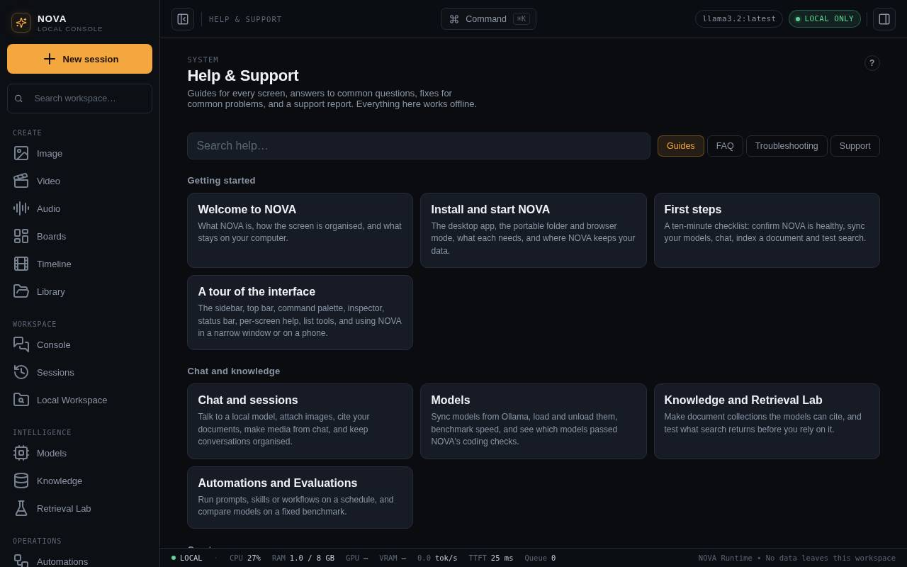
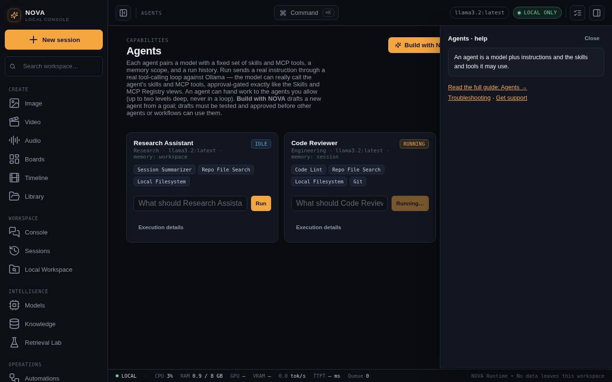
[Video: Searching help, opening a guide and checking the Support tab.](../public/help/media/help-tour.mp4)
### Make a support report

1. Open **Help & Support → Support**.
2. Read the checks at the top: backend, Ollama, coding-qualified models, engines, tool servers, the kill switch and the agent browser. Many problems are solved there, and each red check links to its fix.
3. Press **Copy report** to copy it, or **Save report** to write it to a file in the Maataa Library `support` folder.
4. Read it before you send it, then add what you did, what you expected and what happened.

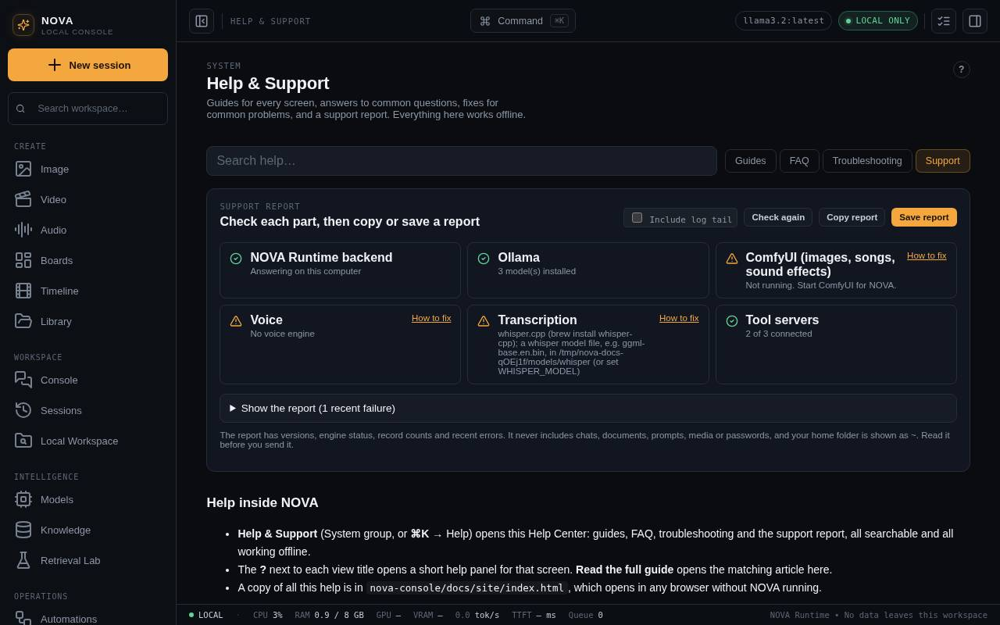
### What the report contains

- Maataa version, Node version, macOS version and chip.
- The size of the database and the number of records in each area (not their contents).
- Ollama status and installed model names; image, video, audio and transcription engine status; connected tool servers.
- Which models passed **Qualify for coding**, the kill switch state and whether a resume passphrase is set, background job counts, and whether the agent browser and the Dafny proof checker are available.
- The most recent failed runs from Execution History: what kind of run, when, and the error message, shortened.
- The end of the server log, if you tick **Include log tail**.

Your home folder is replaced with `~`. The report never includes chats, documents, prompts, media, passwords or tokens. Even so, read it before you share it.

### What else to include

- Whether you used the app, the portable folder or `npm start`.
- The screen, the exact action and roughly when it happened.
- A screenshot of the problem, with anything private removed.

Do not send `nova.db`, private documents or a full log without reading it first.

### Next steps

- [Troubleshooting](#troubleshooting) lists common problems by area.
- [FAQ](#faq) answers the questions people ask most.

## Troubleshooting

### Starting Maataa

#### The app will not open, or macOS says it is damaged or from an unidentified developer

The app is not notarized. Right-click it and choose **Open**, or go to **System Settings → Privacy & Security** and choose **Open Anyway**. If it still fails, open the portable folder's **Start Maataa.command** to see the error in Terminal.

#### The window opens but stays blank or will not load

Wait a few seconds: the window appears once the server answers. If it stays blank, quit Maataa and open it again, then look at the end of `nova-runtime-server.log` in `~/Library/Application Support/com.brahmini.nova-runtime/`.

#### "Port 8787 is busy" or the server exits straight away

Another Maataa is already running (the app, the portable folder or `npm start`). Quit it, or start browser mode with another port, for example `PORT=8790 npm start`.

#### The bottom of the window or the chat box is cut off

Make the window a little larger. On narrow windows the rail and inspector slide over the page; press the menu button to open or close the rail.

### Models and chat

#### "Ollama unavailable"

Start Ollama (open the Ollama app or run `ollama serve`), check `OLLAMA_HOST` if you changed it, then press **Sync from Ollama** in Models. Diagnostics shows **Ollama inference engine** as healthy when it is reachable.

#### No models appear after syncing

Run `ollama list` in Terminal. If it is empty, pull a model, for example `ollama pull llama3.2`. Make sure Maataa and your Terminal use the same Ollama address.

#### Chat will not use the model I picked

Pick a model synced from Ollama, not an example entry, and press **Load** if it needs loading. Check that **Demo mode** is off if you expect real replies.

#### Replies are very slow

Use a smaller model, close heavy apps (ComfyUI video jobs use a lot of memory) and check memory in **Runtime**. The first reply after loading a model is always slower.

### Knowledge

#### A document will not index

Check its status in Knowledge. Make sure an embedding model is available in Ollama, then retry. Use a text-based file; scanned images are not read.

#### Answers ignore my documents

Attach the collection to the session and turn on **Retrieval**. Test the same question in Retrieval Lab to see which chunks come back.

### Images, video and audio

#### "ComfyUI is not running" or image jobs fail at once

Open **Settings > Image engine**. If it says not installed, press **Install ComfyUI** (or choose its folder if it is somewhere other than `~/ComfyUI`). If **Start ComfyUI when needed** is off, turn it on or press **Start now**. If it says it stopped three times, press **Show log**: the last lines say why (often a missing Python package after an update; running the installer again fixes that).

#### The first image takes much longer

That is ComfyUI starting (20–60 seconds). Turn on **Start with Maataa** in **Settings > Image engine** to have it ready in advance, at the cost of some memory.

#### A video job was refused for low memory

Maataa stops heavy jobs rather than freeze your Mac. Close other large apps, pick a shorter length or lower resolution, or use Wan instead of LTX-2.

#### Transcription is unavailable

Install whisper.cpp and ffmpeg (the audio setup scripts do this), then check again on **Help & Support → Support**.

#### The voice sounds robotic

That is the built-in macOS voice. Install Kokoro with **Install Kokoro voices for NOVA.command** for natural voices.

#### I cannot find a file Maataa made

Look in `~/Documents/NOVA Library` in that day's folder. If the item says it could not be saved there, check the folder in **Media → Library folder** and that the disk has space.

### Sources, computer and voice

#### "Reading web pages needs network access" or a git clone is refused

Turn on **Settings > Privacy > Allow network access**. Private repositories need git to be signed in on this Mac already; Maataa never asks for passwords. A page that needs JavaScript or a sign-in may have no readable text.

#### A folder was added but Maataa says it found no readable files

Maataa reads text files only and skips `node_modules`, `.git`, build folders and binary files, up to 600 files and about 12 MB. Add the subfolder that holds your notes or code.

#### Computer is on but Maataa only talks

The model must support tools (for example `qwen2.5` or `llama3.1`); the steps above the reply say when it does not. Also check **Settings > Computer > Let Maataa use this Mac**.

#### Clicks and typing do nothing

Allow Maataa Workstation (or Terminal in browser mode) in **System Settings > Privacy & Security > Accessibility**, then quit and reopen Maataa.

#### Screenshots show only the desktop wallpaper

Allow Maataa Workstation (or Terminal) in **System Settings > Privacy & Security > Screen Recording**, then reopen Maataa.

#### "Outside the approved folders"

Commands and file tools only work inside folders you added to the chat or approved in Local Workspace. Maataa normally asks for the folder itself (press **Allow this folder**); you can also add it with **+ > Add folder**, or type `add folder ~/Desktop` in the message box.

#### "Could not check it visually" when building a page from an image

The check renders the page in a browser Maataa can find: Google Chrome, Chromium, Microsoft Edge or Brave. Install one (or set `NOVA_CHROME` to its path) and ask again.

#### Text from an image has mistakes

Use a sharper or larger screenshot; tiny or blurred text is hard to read. On a Mac Maataa uses Apple's text recognition; if the support report shows "Text in images" as missing, install tesseract (`brew install tesseract`).

#### A character's preview is silent or fails

For a **Kokoro blend**, install Kokoro voices first (double-click **Install Kokoro voices for NOVA.command**). For **VoiceStudio**, open the VoiceStudio app and press **Refresh**. Pitch changes need ffmpeg (`brew install ffmpeg`).

#### Make a face says ComfyUI is not installed

Faces are drawn with ComfyUI. Install it from **Settings > Image engine**, then press **Make a face** again.

#### The helper does not answer, or says it needs a chat model

The helper uses your local model. Start Ollama and press **Sync from Ollama** in **Models**. If the face is gone, turn it back on in **Settings > Helper**.

#### The microphone does not work

Allow Maataa in **System Settings > Privacy & Security > Microphone**. Speaking needs whisper.cpp and a speech model (Help: Audio); recordings from Chrome also need ffmpeg (`brew install ffmpeg`).

#### "No whisper speech model is installed yet" although I installed one

Double-click **Add multilingual speech model.command** in the brahmini folder again. Earlier versions put the model only where Maataa started from the folder looks; the app keeps its own data folder. It now links models you already have into the app without downloading them again or using more space. No restart is needed.

#### A character's shouting, whispering or singing sounds the same as normal speech

Delivery effects need ffmpeg: run `brew install ffmpeg` and press **▶ Preview** again. Check that the line has cues such as `[shout]`, or choose a delivery in the preview list. Automatic delivery per sentence needs a chat model; without one, only cues, CAPITALS and "!" change the delivery.

#### Clicking a generated image does nothing

Update to the latest Maataa: images now open in Maataa's own viewer. In older versions the desktop window ignored links that open a new tab.

### Agents, tools and workflows

#### A skill or agent is blocked

Check that the skill is installed, the tool server is connected in **MCP Registry**, and no approval is waiting. Draft agents must pass a test run and be approved before use.

#### A workflow is stuck

It is probably waiting at a sign-off step: open Workflows and press **Approve** or **Reject**. **Validate** shows steps that point at a missing agent or skill.

#### An automation did not run

It must be **Enabled**, Maataa must be open at the time, and its model and collections must exist. Check its run history and the **Scheduler** check in Diagnostics.

### Workbench and oversight

#### "No installed model is qualified" when Maataa plans code

Open **Models**, press **Sync from Ollama**, then **Qualify for coding** on a model of 7B or larger. Wait until Activity shows the run finished and the card says **6 of 6 passed**. See [Models](models.html#qualify-for-coding).

#### There is no "Qualify for coding" button on a model

The card does not know the model's exact version yet. Press **Sync from Ollama** and look again. Remote models cannot be qualified.

#### A model fails some coding checks

Small models often fail **several files**, **large folder** or **asks when unclear**. Try a larger coding model (for example `qwen2.5-coder:7b` or `14b`). Models of 3.2B parameters or smaller can only plan single-file changes anyway. You can run the checks again; every run is recorded.

#### "Models at or below 3.2B are restricted to qualified single-file workflows"

The request needs changes to more than one file. Use a model larger than 3.2B, or ask for a change to one file.

#### Maataa says it is halted and will not act on my computer

Someone pressed **halt** in Workbench. Open Workbench, check the reason under **Allowed**, and press **resume** with your resume passphrase when it is safe.

#### Resume says the passphrase is not right

The passphrase is case-sensitive. On a server started with `NOVA_RESUME_CREDENTIAL`, that value is also accepted.

#### I lost the resume passphrase

Quit Maataa fully. In Maataa's data folder (see [Settings, privacy and your data](settings-privacy.html#where-your-data-lives)), delete the file `.resume-passphrase`. It is hidden, so press ⇧⌘. in Finder to see it. Start Maataa again and press **resume**: it asks you to choose a new passphrase.

#### "The agent browser needs Playwright"

This copy of Maataa was built without the browser driver. Rebuild the app with **Build NOVA app.command** (it downloads the driver once), or in browser mode run `npm install` in `nova-console`. Nothing else in Maataa needs it.

#### "The agent browser uses the Chrome on this computer"

Install Google Chrome (or Edge, Brave or Chromium) in Applications, then open **Agent Browser** again. If Chrome is somewhere unusual, set `NOVA_AGENT_CHROME` to its program file before starting Maataa.

#### The agent browser says it needs network access

Turn on **Settings > Privacy > Allow network access**. Pages on this computer (`localhost`, `127.0.0.1`) open without it.

#### An agent page is refused, or looks broken

The website is not on the allowed list, or the page loads pictures, scripts or fonts from other websites. Open **Agent Browser**, look under **Blocked addresses**, and press **Allow** for the ones you trust.

#### Neuron Factory says training is refused

**Macro** blueprints need **Approve macro job** first, and nothing trains while Maataa is halted (resume it in Workbench). An error about the training specification names the value that is out of range; the limits are in [Neuron Factory](neuron-factory.html#scale).

#### The setup checklist will not reach 5 / 5

Step 2 needs a model that passed **Qualify for coding**. Step 5 needs a code change applied after its checks passed in Local Workspace, or an improve-and-test loop that ended with passing tests. See [The setup checklist](getting-started-checklist.html).

#### The Workbench strip in the top bar shows "—"

Maataa could not read Workbench's state. It retries after 30 seconds. If it stays, open Workbench to see the error, and make a support report.

### Local Workspace

#### "install" is refused

Turn on **Settings → Allow network access**, and make sure install is in the project's approved allowlist (**Add install and dev to allowlist**).

#### A change batch will not apply or roll back

A file changed since the batch was checked or applied. Validate the batch again, or undo your own edit to that file, then retry.

### Disk and performance

#### Maataa or the build script says there is not enough space

Packing needs about 3 GB free and video jobs need room for their output. Empty large downloads, old builds in `nova-console/packaging/dist/` or old items in your Maataa Library.

#### Still stuck?

Open **Help & Support → Support**, make a support report and send it with a short description of what happened. See [Get help and support](support.html).

## Frequently asked questions

### About Maataa

#### What is Maataa?

A private AI workspace that runs on your Mac: chat with local models, search your own documents, make images, video and audio, and build agents and workflows. See [Welcome to Maataa](welcome.html).

#### Is Maataa cloud-hosted? Does my data leave my computer?

No. Maataa's server listens only on `127.0.0.1`, and Ollama is local by default. Data leaves only if you turn on **Allow network access** and use something that needs it, load a remote model, or copy material out yourself. The privacy badge in the status bar tells you which state you are in. See [Settings, privacy and your data](settings-privacy.html).

#### Does Maataa include a model?

No. Install Ollama, pull a model (for example `ollama pull llama3.2`), then press **Sync from Ollama** in Models. See [Models](models.html).

#### Can I use Maataa without Ollama?

You can open Maataa, look around and use the media engines, but chat, document search, agents, evaluations and automations need a model from Ollama.

#### Does Maataa need the internet?

Only to install things (Ollama models, ComfyUI, packages) and for features you point at the web, such as the collector. Everyday chat, search and media work offline.

#### Are the records I see real?

Some screens start with labelled examples so you can see how they work. A synced model, an indexed document, a connected tool server and a finished run in Execution History are the proof that a feature is working on your Mac.

### Chat and knowledge

#### How do I make Maataa answer from my documents?

Add them to a collection in Knowledge, wait for indexing to finish, then attach the collection to your session and turn on **Retrieval**. Answers then cite the passages they used. See [Knowledge and Retrieval Lab](knowledge.html).

#### Which files can I add to Knowledge?

Plain text, Markdown, HTML and other supported text documents. Scanned images without text are not read.

#### Why are search results poor?

Check the chunks in Retrieval Lab. Clean up the source, split very long documents and ask more specific questions. An embedding model must be available in Ollama.

#### Can I branch a conversation?

Yes. **Fork** copies the session so you can try another direction; **Snapshot** saves its current state. Both are in the command palette (**⌘K**).

#### Can I give Maataa a folder, a web page or a git repository to read?

Yes. Press **+** under the message box and choose **Add folder**, **Add files**, **Add web page** or **Add git repo**, or drag files onto the chat. Maataa reads it once and answers from it, naming the files it used. See [Add sources, live steps, computer and voice](conversation.html).

#### Can Maataa read code or text from a screenshot?

Yes. Add the image and ask, for example, "extract the code". Maataa reads the exact text with text recognition on this Mac and gives it to the model, so even text-only models can work with it. See [Add sources, live steps, computer and voice](conversation.html).

#### Can Maataa turn a screenshot or design into a web page?

Yes. Attach it and ask "build this as a web page". Maataa writes the HTML, checks it in a sandboxed browser against your image, fixes the differences (up to three tries) and shows both side by side with **Open page** and **Copy HTML**.

#### Can I keep typing while Maataa is answering?

Yes. Your next message is queued and answered as soon as the current reply finishes. Replies in different chats, and folders being read, run at the same time; the list icon at the top shows them all.

#### Does Maataa remember things about me?

Only what you ask it to. Say "remember that …", or press the brain on a reply. Notes are listed in **Settings > Memory**, where you can delete them. "Forget …" removes matching notes.

### Making things

#### What do I need for images, video and audio?

ComfyUI for images, songs and sound effects (install it from **Settings > Image engine**; Maataa starts it when needed, so you never start it yourself), LTX-2 or Wan for AI video, Kokoro for better voices and whisper.cpp for transcripts. Each has a double-click installer in the brahmini folder. See [Images](media-images.html).

#### Where are the files Maataa makes?

In `~/Documents/NOVA Library`, one folder per day, with a `.json` recipe next to each file so you can make it again. Change the folder in **Media → Library folder**.

#### Will a video job freeze my Mac?

Maataa checks free memory before heavy jobs and refuses or lowers settings if there is not enough. Close other large apps for long videos. See [Video](media-video.html).

#### Can I edit an image or video after it is made?

Yes. **Filters** applies looks, crops, speed changes and fades as a new item; the original is kept. Boards and the Timeline arrange and join clips. See [Boards, Timeline and Library](boards-library.html).

### Agents, workflows and tools

#### Can Maataa build agents on its own?

Yes. **Build with Maataa** on Agents drafts an agent from a description. Drafts must pass a test run and be approved by you before they can be used. See [Agents](agents.html).

#### What is the difference between an agent and a workflow?

An agent decides its own steps to reach a goal using the tools you allow. A workflow is a fixed line of steps (agents, skills, tools and sign-offs) that runs the same way every time. See [Workflows](workflows.html).

#### Why does Maataa ask for approval?

Tools can read files, run commands or change things. Maataa asks before a tool acts, following the approval policy of each tool server. See [Tools and approvals](tools-approvals.html).

#### Can Maataa publish, send or delete things by itself?

Only if you give an agent or workflow a tool that can, and approve it. Put a sign-off step before anything that publishes, sends, deletes or changes files.

#### Can Maataa control my computer?

Only in chats where you turn on **Computer**, and only after you approve each action. It can run commands in approved folders, open apps, files and links, look at the screen and click or type, use the clipboard, and create, move or rename files. It never deletes (Move to Trash can be undone) and refuses administrator and disk-erasing commands. See [Add sources, live steps, computer and voice](conversation.html).

#### Can agents have their own personality and voice?

Yes. **Voice Studio** makes characters with a personality, a way of speaking, a face and a voice. Blend Kokoro voices, use a macOS voice, or use the VoiceStudio app for cloned voices. Give a character to an agent, or let Maataa speak as one. See [Voice Studio](voice-studio.html).

#### Can a character shout, whisper, taunt or sing?

Yes. Each character has a delivery that follows its personality, and your local model can choose the delivery sentence by sentence. You can also write cues such as `[shout]`, `[whisper]`, `[taunt]` or `[sing]` in the text. Kokoro and macOS voices act these out with effects (ffmpeg needed); a real song with music is made in **Media > Audio > Song**. See [Voice Studio](voice-studio.html#delivery-emotion-and-mode).

#### Can Maataa speak in my own voice?

Yes, through the free VoiceStudio app: clone your voice there (it asks for permission and watermarks what it makes), then choose it as a character's voice in Voice Studio. Only clone voices you have the right to use. See [Voice Studio](voice-studio.html#voicestudio-app).

#### Can I talk to Maataa instead of typing?

Yes. Hold the microphone button under the message box while you speak. whisper.cpp transcribes you on this Mac. Turn on **Voice** to hear replies read aloud.

#### Can automations run on a schedule?

Yes. Automations run on a timer while Maataa is open. Workflow schedules are not wired up yet; run a workflow from an automation instead. See [Automations and evaluations](automations.html).

#### Can Maataa change my code?

Only in folders you approve in Local Workspace, and only after you review and apply each change batch. Every batch can be rolled back. Planning code needs a model that passed **Qualify for coding** in Models. See [Local Workspace and projects](workspace.html).

### Oversight

#### What is Workbench?

One page that shows Maataa's background work: what is running, what waits for your decision, what it may do, what broke and what it produced. It has the kill switch. See [Workbench](workbench.html).

#### Why are most Workbench panels empty?

They fill as background work runs: jobs, connectors, agents of the multi-agent system and autonomy runs. Several of these are not started from the console yet, so on a new install Workbench is mostly quiet. See [Built, not yet in the console](developer-preview.html).

#### What does the kill switch stop?

Background jobs, autonomy runs, multi-agent agents, the agent browser and computer actions from chat. Chat keeps working. Resuming needs the resume passphrase you choose the first time. See [Workbench](workbench.html#the-kill-switch).

#### Why does Maataa say my model is not qualified to plan code?

Code plans and the improve-and-test loop only use models that passed Maataa's coding checks. Open **Models** and press **Qualify for coding** on the model, then wait for the 18 trials to finish. See [Models](models.html#qualify-for-coding).

#### What does "setup: 3 / 5" mean?

How many of five setup steps this computer has done. Click it to see the rest. See [The setup checklist](getting-started-checklist.html).

#### Can Maataa work with GitHub?

A GitHub connector is built. It can read repositories, issues, pull requests and checks, and open or merge a pull request, each one checked by a policy and approved in Workbench. It is not started from the console yet. See [Built, not yet in the console](developer-preview.html).

#### Are tokens I give Maataa safe?

Connector tokens are stored encrypted (AES-256-GCM) in the secrets vault. The key is a file in Maataa's data folder that only your user account can read, and a token is never shown again after you save it.

#### What is the Neuron Factory?

A screen for training very small, single-purpose models on your Mac: a tiny neural network from your examples, or a simulated quantum circuit. You check each result's quality and approve it. It does not change your Ollama models. See [Neuron Factory](neuron-factory.html).

#### What is the agent browser?

A separate, locked-down browser that agents use, limited to the websites you allow, with every action recorded. **Agent Browser** in the sidebar shows the allowed websites, open pages, activity and blocked addresses, and lets you try a page yourself. It does not use your own browser profile or your sign-ins. See [Agent Browser](agent-browser.html).

### Data and settings

#### Where is my data stored?

The app keeps its database and log in `~/Library/Application Support/com.brahmini.nova-runtime/`. Browser mode uses `nova-console/data/` unless `DATA_DIR` is set.

#### How do I back up Maataa?

Quit Maataa, then copy the data folder and your Maataa Library. Restore with Maataa closed.

#### How do I delete my data?

Delete single items in their views, or use **Settings → Reset workspace data** to delete everything in the database. Back up first; a reset cannot be undone.

#### Can I use Maataa in Hindi?

Yes. **Settings → Interface language → हिन्दी** switches the interface. The **Translate** skill translates your text into Hindi or other languages.

#### Does Maataa work on a phone or small window?

The console adjusts to narrow windows: the menu button opens the side rail and the inspector slides over the page. Maataa itself still runs on your Mac.

### The app

#### Why does macOS say the app cannot be opened?

The app is not signed with an Apple Developer ID or notarized. Right-click it and choose **Open**, or allow it in **System Settings → Privacy & Security**. See [The desktop app and portable pack](desktop-app.html).

#### Do I need to install Node?

Not for the packed app or portable folder: they carry their own. Browser mode needs Node 22.5 or newer.

#### Is the app ready to give to other people?

It works on Macs you trust, but it is not notarized, so each person has to approve it the first time. A public release needs Developer ID signing and notarization.

#### How do I update Maataa?

Pull the latest code and double-click **Build NOVA app.command**, then replace the app in Applications. Your data stays in its own folder and is kept.

#### Is there an assistant that can show me how to use Maataa?

Yes: the face in the bottom right corner. Ask it anything about Maataa by typing or holding its mic, and press **Show me** for a step-by-step walkthrough on screen. It explains and points; it never changes anything itself. See [The helper](helper.html).

#### Where do I get more help?

Open **Help & Support → Support** to check each part and make a support report. See [Get help and support](support.html).
